# 🏛️ Diagrama 4+1 Views — KuHubProject

**Sistema de Gestión de Bodega e Inventario para DuocUC**  
**Versión**: v1.0.8  
**Última actualización**: 12 de mayo de 2026

> **📁 Archivos editables en draw.io**: Ver carpeta `/diagramas/`
> - `1_vista_logica.drawio`
> - `2_vista_procesos.drawio`
> - `3_vista_fisica.drawio`
> - `4_vista_desarrollo.drawio`
> - `5_vista_escenarios.drawio`

---

## 📑 Tabla de Contenidos

1. [Vista Lógica (Logical View)](#1-vista-lógica)
2. [Vista de Procesos (Process View)](#2-vista-de-procesos)
3. [Vista Física (Physical View)](#3-vista-física)
4. [Vista de Desarrollo (Development View)](#4-vista-de-desarrollo)
5. [Vista de Escenarios (Scenarios View)](#5-vista-de-escenarios)

---

## 1. Vista Lógica

**Propósito**: Mostrar los componentes principales del sistema y cómo interactúan entre sí.  
**Audiencia**: Arquitectos, desarrolladores backend/frontend, team leads.

### Diagrama

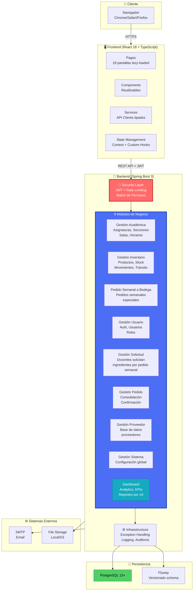

### Descripción de Componentes

| Componente | Responsabilidad | Tecnología |
|---|---|---|
| **Pages** | 18 pantallas (dashboard, inventario, usuarios, etc.) | React 18, React Router v5 |
| **Components** | Componentes reutilizables (modales, tablas, cards) | HeroUI, Tailwind CSS |
| **Services** | Clientes HTTP para cada dominio | Axios, TypeScript |
| **State** | Gestión de estado (auth, permisos, tema) | Context API, Custom Hooks |
| **Security** | Autenticación JWT, rate limiting, permisos | Spring Security, JWT, RBAC |
| **Modules** | Lógica de negocio por dominio | Spring Boot Services |
| **Infrastructure** | Capas transversales | Exception Handling, Logging |
| **PostgreSQL** | Base de datos relacional | PostgreSQL 13+ |

### Archivo editable

Descargar y editar: **`diagramas/1_vista_logica.drawio`**

---

## 2. Vista de Procesos

**Propósito**: Mostrar cómo interactúan los componentes para realizar procesos de negocio críticos por rol.  
**Audiencia**: Product managers, business analysts, QA, desarrolladores backend, gestores del proyecto.

### 2.1 Matriz de Roles, Módulos y Capacidades (Del SQL real)

```mermaid
graph TB
    subgraph Roles["🎭 7 ROLES DEL SISTEMA"]
        R1["1️⃣ ADMINISTRADOR<br/>Control total"]
        R2["2️⃣ CO-ADMIN<br/>Sin roles/admin-sistema"]
        R3["3️⃣ GESTOR PEDIDOS<br/>Solicitud+Pedido"]
        R4["4️⃣ PROFESOR A CARGO<br/>Solicitud+Pedido Sem. Bodega"]
        R5["5️⃣ DOCENTE<br/>Lectura Solicitud"]
        R6["6️⃣ ENC. BODEGA<br/>Inventario completo"]
        R7["7️⃣ ASISTENTE<br/>Bodega lectura"]
    end

    subgraph Módulos["🔧 16 MÓDULOS EN BD"]
        M1["Dashboard"]
        M2["Inventario"]
        M3["Solicitud"]
        M4["Gestión Solicitudes"]
        M5["Gestión Pedidos"]
        M6["Gestión Académica"]
        M7["Gestión Sistema"]
        M8["Bodega Tránsito"]
        M9["Pedido Sem. Bodega"]
        M10["Categorías"]
        M11["Unidades"]
        M12["Hist. Movimientos"]
        M13["Ped. Diarios"]
        M14["Gestión Usuarios"]
        M15["Gestión Roles"]
        M16["Admin Sistema"]
    end

    R1 -.->|C+R+U+D| M1
    R1 -.->|C+R+U+D| M2
    R1 -.->|C+R+U+D| M3
    R1 -.->|C+R+U+D| M4
    R1 -.->|C+R+U+D| M5
    R1 -.->|C+R+U+D| M6
    R1 -.->|C+R+U+D| M7
    R1 -.->|C+R+U+D| M8
    R1 -.->|C+R+U+D| M9
    R1 -.->|C+R+U+D| M10
    R1 -.->|C+R+U+D| M11
    R1 -.->|C+R+U+D| M12
    R1 -.->|C+R+U+D| M13
    R1 -.->|C+R+U+D| M14
    R1 -.->|C+R+U+D| M15
    R1 -.->|C+R+U+D| M16
    
    R2 -->|C+R+U+D| M1
    R2 -->|C+R+U+D| M2
    R2 -->|C+R+U+D| M3
    R2 -->|C+R+U+D| M4
    R2 -->|C+R+U+D| M5
    R2 -->|C+R+U+D| M6
    R2 -->|C+R+U| M14
    
    R3 -->|R| M1
    R3 -->|C+R+U| M4
    R3 -->|C+R+U| M5
    
    R4 -->|R| M1
    R4 -->|C+R+U| M3
    
    R5 -->|R| M1
    R5 -->|R| M3
    
    R6 -->|R| M1
    R6 -->|C+R+U| M2
    R6 -->|C+R+U| M8
    R6 -->|C+R+U| M10
    R6 -->|C+R+U| M11
    R6 -->|C+R+U| M12
    R6 -->|C+R+U| M13
    
    R7 -->|R| M1
    R7 -->|C+R| M8
    R7 -->|R| M12
    R7 -->|C+R| M13
    R7 -->|R| M10
    R7 -->|R| M11

    style R1 fill:#ff6b6b,stroke:#c92a2a,color:#fff
    style R3 fill:#4c6ef5,stroke:#1540ab,color:#fff
    style R4 fill:#f59f00,stroke:#d9780f,color:#fff
    style R6 fill:#51cf66,stroke:#2b8a3e,color:#000
    style R7 fill:#90ee90,stroke:#2b8a3e,color:#000
```

### 2.2 Flujo Principal: Docente Crea Solicitud

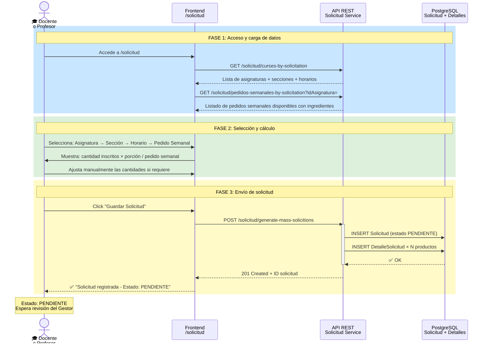

### 2.3 Flujo: Gestor Revisa y Consolida Solicitudes

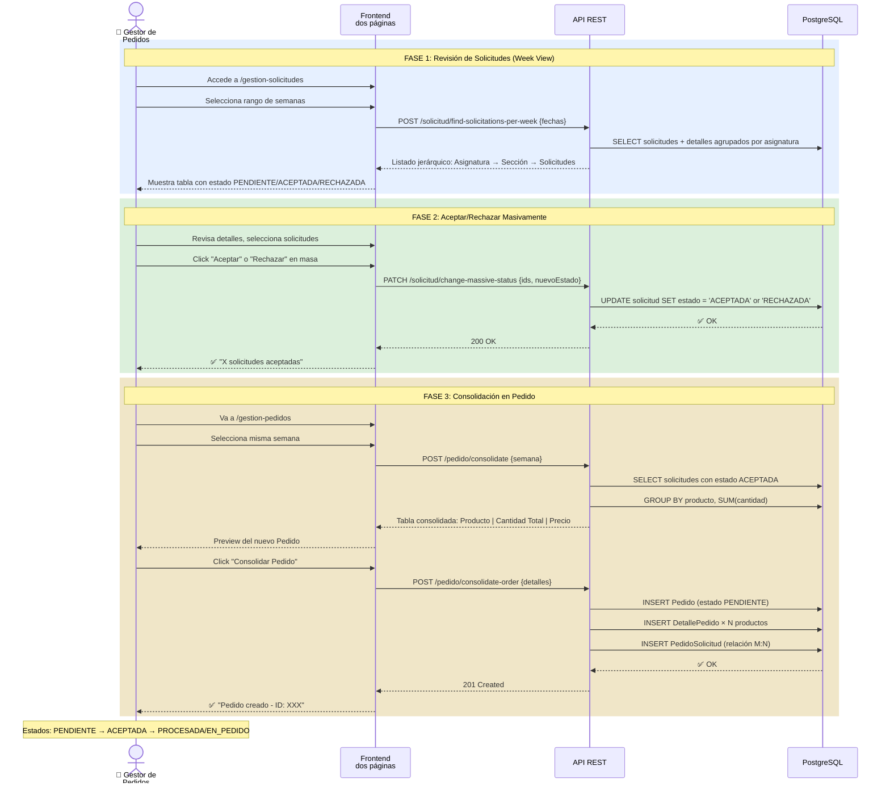

### 2.4 Flujo: Encargado de Bodega Recibe Pedido y Gestiona Inventario

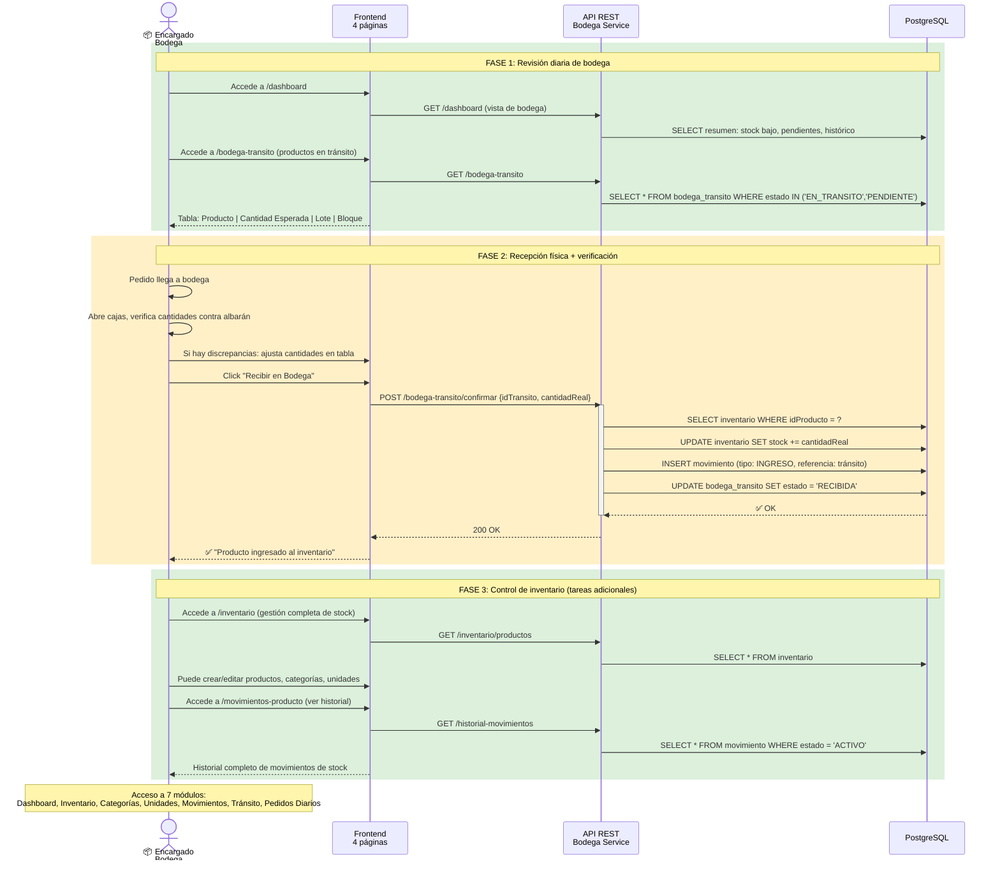

### 2.5 Flujo: Admin Visualiza Dashboards con KPIs

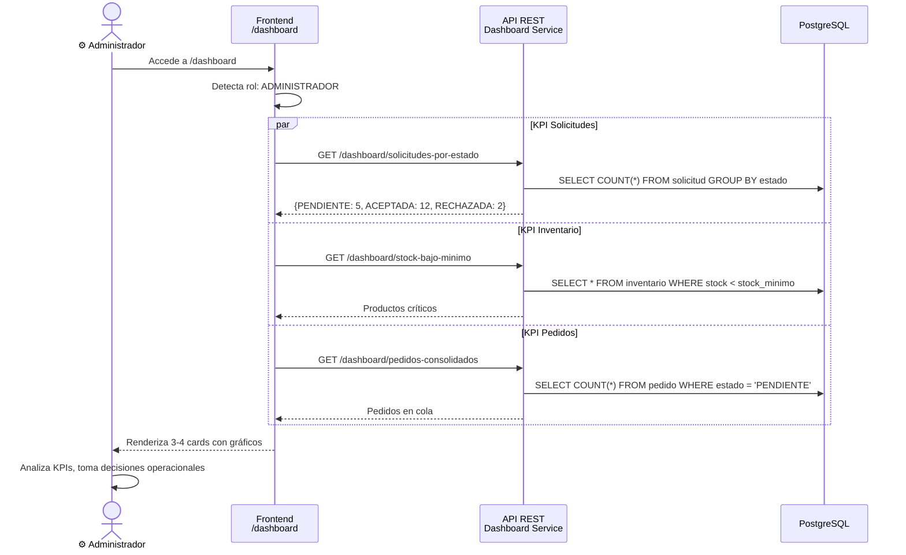

### 2.6 Diagrama de Estados: Solicitud

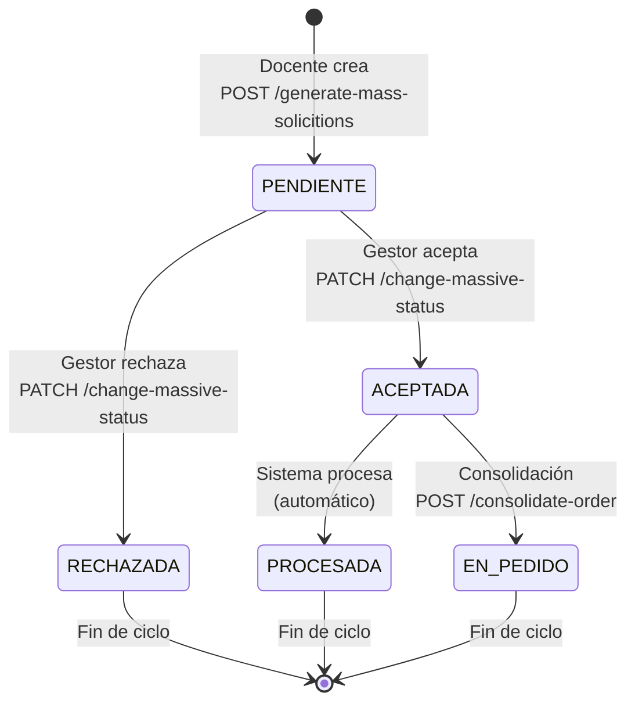

### 2.7 Diagrama de Estados: Pedido

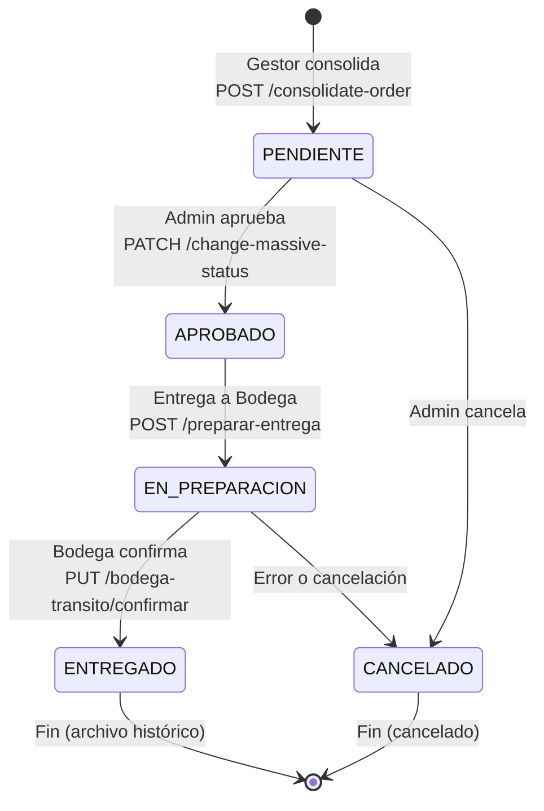

### 2.8 Matriz de Acceso por Rol (Basada en ConexionXD_v2.sql líneas 828-1096)

| Rol | Módulos | Acceso Lectura | Crear | Actualizar | Eliminar |
|---|---|---|---|---|---|
| **1. Administrador** | TODOS (16 módulos) | ✅ | ✅ | ✅ | ✅ |
| **2. Co-Administrador** | Todos EXCEPTO `GESTION_ROLES`, `ADMIN_SISTEMA` | ✅ | ✅ | ✅ | ✅ (excepto GESTION_USUARIOS: NO elimina) |
| **3. Gestor de Pedidos** | DASHBOARD, GESTION_PEDIDOS, GESTION_SOLICITUDES, CONGLOMERADO_PEDIDOS | ✅ | ✅ (excepto DASHBOARD) | ✅ (excepto DASHBOARD) | ❌ |
| **4. Profesor a Cargo** | DASHBOARD, SOLICITUD, PEDIDO_SEMANAL_BODEGA | ✅ | ✅ (SOLICITUD) | ✅ (SOLICITUD) | ❌ |
| **5. Docente** | DASHBOARD, SOLICITUD, PEDIDO_SEMANAL_BODEGA | ✅ (lectura solo) | ❌ | ❌ | ❌ |
| **6. Encargado de Bodega** | DASHBOARD, INVENTARIO, GESTION_CATEGORIAS, GESTION_UNIDADES, HISTORIAL_MOVIMIENTOS, GESTION_PEDIDOS_DIARIOS, BODEGA_TRANSITO | ✅ | ✅ | ✅ | ❌ |
| **7. Asistente de Bodega** | DASHBOARD, BODEGA_TRANSITO, HISTORIAL_MOVIMIENTOS, GESTION_PEDIDOS_DIARIOS, GESTION_CATEGORIAS, GESTION_UNIDADES | ✅ | ✅ (BODEGA_TRANSITO, GESTION_PEDIDOS_DIARIOS) | ❌ | ❌ |

**⚠️ ACLARACIONES CRÍTICAS (Del SQL real):**

1. **PEDIDO_SEMANAL_BODEGA**: Módulo de pedidos semanales para bodega. Acceso en Profesor a Cargo y Docente, funcionalidad integrada en `/pedido-semanal-a-bodega`.

2. **Módulos adicionales encontrados en SQL** (no en el backend inicial):
   - `GESTION_CATEGORIAS` - Gestión de categorías de productos
   - `GESTION_UNIDADES` - Gestión de unidades de medida
   - `HISTORIAL_MOVIMIENTOS` - Historial de stock
   - `GESTION_PEDIDOS_DIARIOS` - Pedidos diarios para bodega

3. **Encargado de Bodega** accede a 7 módulos (más de lo documentado):
   - DASHBOARD (lectura)
   - INVENTARIO (C+R+U)
   - GESTION_CATEGORIAS (C+R+U)
   - GESTION_UNIDADES (C+R+U)
   - HISTORIAL_MOVIMIENTOS (C+R+U)
   - GESTION_PEDIDOS_DIARIOS (C+R+U)
   - BODEGA_TRANSITO (C+R+U)

4. **Asistente de Bodega** accede a 6 módulos:
   - DASHBOARD (lectura)
   - BODEGA_TRANSITO (C+R)
   - HISTORIAL_MOVIMIENTOS (lectura)
   - GESTION_PEDIDOS_DIARIOS (C+R+U)
   - GESTION_CATEGORIAS (lectura)
   - GESTION_UNIDADES (lectura)

5. **Co-Administrador** NO puede eliminar en GESTION_USUARIOS

### 2.9 Flujos Secundarios

#### Flujo: Profesor Gestiona Pedido Semanal a Bodega

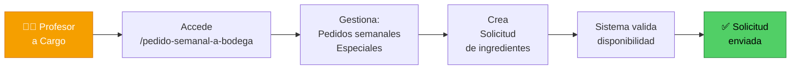

#### Flujo: Admin Configura Sistema

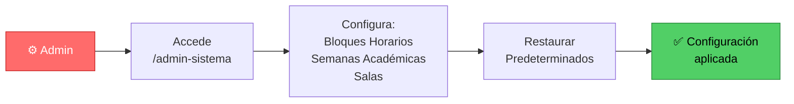

### 2.10 Endpoints Clave por Flujo

| Flujo | Método | Endpoint | Rol Permitido |
|---|---|---|---|
| **Solicitud: Crear** | POST | `/api/v1/solicitud/generate-mass-solicitions` | Docente, Profesor |
| **Solicitud: Listar semana** | POST | `/api/v1/solicitud/find-solicitations-per-week` | Gestor |
| **Solicitud: Cambiar estado** | PATCH | `/api/v1/solicitud/change-massive-status` | Gestor, Admin |
| **Pedido: Consolidar** | POST | `/api/v1/pedido/consolidate-order` | Gestor |
| **Pedido: Consulta GOD** | POST | `/api/v1/pedido/consolidate` | Gestor, Admin |
| **Bodega: Confirmar recepción** | PUT | `/api/v1/bodega-transito/confirmar` | Encargado, Admin |
| **Bodega: Ver tránsito** | GET | `/api/v1/bodega-transito` | Bodega, Admin |
| **Dashboard: KPIs** | GET | `/api/v1/dashboard/...` | Todos (según rol) |

### Archivo editable

Descargar y editar: **`diagramas/2_vista_procesos.drawio`**

---

## 3. Vista Física

**Propósito**: Mostrar cómo se distribuyen los componentes en la infraestructura (despliegue).  
**Audiencia**: DevOps, SRE, arquitectos de infraestructura.  
**Entorno Actual**: AWS Lightsail (Virginia, Zona A) — 2 instancias distribuidas

### Diagrama: Topología de Despliegue (AWS Lightsail)

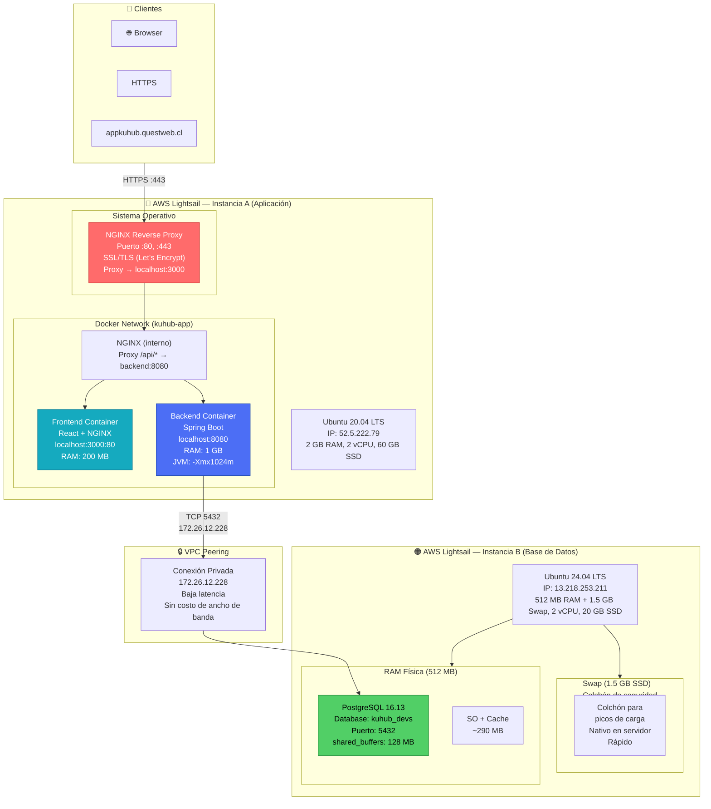

### Componentes de Infraestructura Actual

| Componente | Propósito | Detalles | Estado |
|---|---|---|---|
| **NGINX (Host)** | Reverse proxy SSL/TLS | Puertos :80/:443, Let's Encrypt, termina TLS, proxy a :3000 | ✅ Activo |
| **Frontend Container** | React SPA + NGINX interno | Proxy /api/* → backend:8080, 200 MB RAM | ✅ Activo |
| **Backend Container** | Spring Boot monolítico | 1 instancia, 1 GB RAM, JVM heap 768-1024 MB | ✅ Activo |
| **PostgreSQL** | Base de datos relacional | Instancia única en Lightsail B, 128 MB shared_buffers | ✅ Activo |
| **VPC Peering** | Red privada AWS | IP privada 172.26.12.228, baja latencia, sin metraje | ✅ Activo |

### Certificación SSL/TLS

| Parámetro | Valor |
|---|---|
| **Certificado** | Let's Encrypt (ISRG Root X1) |
| **Dominio** | `appkuhub.questweb.cl` |
| **Válido hasta** | 2026-07-09 (renovación automática cada 60 días) |
| **Renovación** | Certbot + systemd timer automático |
| **Ubicación** | `/etc/letsencrypt/live/appkuhub.questweb.cl/` |

### Almacenamiento y Memoria

**Instancia A (Aplicación):**
- Memoria Total: 2 GB RAM
- Docker Frontend: 200 MB
- Docker Backend: 1 GB (límite 1.4 GB)
- SO + nginx: ~600 MB
- **Estado**: Presupuesto bien balanceado

**Instancia B (Base de Datos):**
- Memoria RAM Total: 512 MB
  - PostgreSQL: 100-150 MB
  - SO: ~100 MB
  - Buffer/Cache: ~190 MB
  - **Disponible inmediato**: 181 MB
- **Memoria Virtual (Swap): 1.5 GB** ← Colchón de seguridad nativo en servidor
  - Uso actual: 41 MB
  - Permite operaciones imprevistas sin crashes
  - Más rápido que swapping a disco externo (está en SSD local)
  
**⚠️ Nota de arquitectura:** El Swap de 1.5 GB actúa como colchón de seguridad. Si se excede RAM, PostgreSQL puede usar Swap temporalmente sin interrumpir servicio. Ideal para picos de carga esporádicos.

### Flujo de Tráfico (Request/Response)

```
1. Cliente HTTPS (appkuhub.questweb.cl) → NGINX Host (:443)
2. NGINX Host desencripta TLS, valida CORS, agrega X-Forwarded-*
3. NGINX Host proxy → Frontend Container (:3000)
4. Frontend Container NGINX → Detecta /api/*, proxy → Backend (:8080)
5. Backend → Query a PostgreSQL vía VPC Peering (172.26.12.228:5432)
6. PostgreSQL → Respuesta → Backend → Frontend → Cliente (HTTPS)
```

### 3.2 CI/CD Pipeline — Build y Deploy Automático

```mermaid
graph LR
    subgraph Local["💻 Local Developer"]
        GIT["Git Commit + Push"]
        TAG["git tag K1.0.X<br/>git push origin K1.0.X"]
    end

    subgraph GHA["🤖 GitHub Actions (ubuntu-latest)"]
        direction TB
        CHECKOUT["Checkout Code<br/>from tag K1.0.X"]
        LOGIN["Login Docker Hub<br/>martorias/kuhub-app"]
        BUILDBE["Build Backend<br/>Maven 3.9.6 + Java 21<br/>Dockerfile multistage"]
        BUILDFE["Build Frontend<br/>Node 20 + npm<br/>Dockerfile multistage"]
        PUSHBE["Push to Docker Hub<br/>martorias/kuhub-app:backend-K1.0.X"]
        PUSHFE["Push to Docker Hub<br/>martorias/kuhub-app:frontend-K1.0.X"]
        
        CHECKOUT --> LOGIN
        LOGIN --> BUILDBE
        LOGIN --> BUILDFE
        BUILDBE --> PUSHBE
        BUILDFE --> PUSHFE
    end

    subgraph Lightsail["☁️ AWS Lightsail (Instancia A)"]
        direction TB
        SSH["SSH Key-based Auth<br/>base64 decode secret"]
        COPY["SCP: docker-compose.yml"]
        CLEANUP["docker compose down<br/>docker rmi -f old images<br/>docker image prune -af"]
        ENV["Update .env<br/>TAG=K1.0.X"]
        PULL["docker compose pull<br/>martorias/kuhub-app:backend-K1.0.X<br/>martorias/kuhub-app:frontend-K1.0.X"]
        UP["docker compose up -d<br/>kuhub-frontend + kuhub-backend"]
        VERIFY["docker ps<br/>✅ Verify running"]
    end

    GIT --> TAG
    TAG -->|"Trigger on tag push"| CHECKOUT
    PUSHBE --> SSH
    PUSHFE --> SSH
    SSH --> COPY
    COPY --> CLEANUP
    CLEANUP --> ENV
    ENV --> PULL
    PULL --> UP
    UP --> VERIFY

    style CHECKOUT fill:#4c6ef5,stroke:#1540ab,color:#fff
    style PULL fill:#51cf66,stroke:#2b8a3e,color:#000
    style UP fill:#51cf66,stroke:#2b8a3e,color:#000
    style VERIFY fill:#ccffcc,stroke:#00aa00,color:#000,stroke-width:3px
```

### Build Multistage — Optimización de Imágenes

**Backend (Java Spring Boot)**

| Etapa | Base | Contenido | Resultado |
|---|---|---|---|
| **Build** | maven:3.9.6-temurin-21-alpine | Compila con Maven, genera JAR | Grande (~800 MB, descartado) |
| **Runtime** | eclipse-temurin:21-jre-alpine | Copia solo JAR, executa con JVM | Pequeño (~200-250 MB) |

```dockerfile
# ETAPA 1: Build
FROM maven:3.9.6-eclipse-temurin-21-alpine AS build
# ... compila el proyecto completo

# ETAPA 2: Runtime (solo lo necesario)
FROM eclipse-temurin:21-jre-alpine
COPY --from=build /app/backend/target/*.jar app.jar
ENTRYPOINT ["java", "-Xmx1024m", "-Xms768m", "-jar", "app.jar"]
```

**Frontend (React + Nginx)**

| Etapa | Base | Contenido | Resultado |
|---|---|---|---|
| **Build** | node:20-alpine | npm ci + npm run build, genera dist/ | Grande (~400 MB, descartado) |
| **Runtime** | nginx:1.25-alpine | Copia solo dist/, sirve con Nginx | Pequeño (~40-50 MB) |

```dockerfile
# ETAPA 1: Build
FROM node:20-alpine AS build
# ... npm ci y npm run build

# ETAPA 2: Runtime (solo lo necesario)
FROM nginx:1.25-alpine
COPY --from=build /app/dist /usr/share/nginx/html
COPY nginx.conf /etc/nginx/conf.d/default.conf
```

### Estrategia de Despliegue

| Aspecto | Configuración | Propósito |
|---|---|---|
| **Trigger** | Tag `K*.*.*` (ej: K1.0.8) | Una build por versión, versionado semántico |
| **Registry** | Docker Hub (martorias/kuhub-app) | Caché distribuido, acceso rápido |
| **Cache Builder** | `type=registry` | Reutiliza capas previas, acelera builds |
| **Servidor Destino** | AWS Lightsail 52.5.222.79 | 2 GB RAM, estable para dev |
| **Limpieza** | `docker image prune -af` | Evita acumulación de imágenes huérfanas |
| **Reinicio** | `docker compose up -d` | Restart policy: always (recuperación automática) |

### 3.3 Variables de Entorno y Secrets

#### GitHub Actions Secrets (11 variables configuradas en Repository Settings)

| # | Variable | Tipo | Descripción | Uso |
|---|---|---|---|---|
| 1 | `DOCKER_AWS_AC_USERNAME` | Secret | Usuario/nombre de cuenta Docker Hub para autenticarse en docker login | GitHub Actions: docker/login-action@v3 |
| 2 | `DOCKER_AWS_AC_PASSWORD` | Secret | Token de acceso personal (PAT) de Docker Hub para login y push (NUNCA compartir) | GitHub Actions: docker/login-action@v3 |
| 3 | `KUHUB_MASTER_KEY` | Secret | Clave SSH privada EC2 (base64 encoded) para autenticación SSH a Lightsail | GitHub Actions: SSH a 52.5.222.79 |
| 4 | `AWS_REMOTE_HOST` | Secret | Dirección IP pública de Instancia A (Aplicación) en AWS Lightsail | GitHub Actions: SSH host |
| 5 | `AWS_REMOTE_USER` | Secret | Usuario del SO Ubuntu en instancia Lightsail para conexión SSH | GitHub Actions: SSH user |
| 6 | `SPRING_DATASOURCE_URL` | Secret | URL JDBC completa de PostgreSQL para Spring Boot (jdbc:postgresql://172.26.12.228:5432/kuhub_devs) | docker-compose.yml → backend container |
| 7 | `KU_AWS_AC_DB_USER` | Secret | Usuario de base de datos PostgreSQL (kuhub_devs) | docker-compose.yml → backend container |
| 8 | `KU_AWS_AC_DB_PASS` | Secret | Contraseña del usuario PostgreSQL (NUNCA compartir, cambiar periódicamente) | docker-compose.yml → backend container |
| 9 | `KU_AWS_AC_DB_HOST` | Secret | Host/IP privado de BD en Lightsail (172.26.12.228) — usado en construcción de URLs | docker-compose.yml / backend config |
| 10 | `KU_AWS_AC_DB_PORT` | Secret | Puerto de PostgreSQL en Lightsail (5432) | docker-compose.yml / backend config |
| 11 | `VITE_API_URL` | Secret | URL base de la API para frontend (https://appkuhub.questweb.cl/api/v1 en prod, http://localhost:8080/api/v1 en dev) | Frontend build: vite.config.ts |

#### Variables de Entorno en Tiempo de Deploy

| Variable | Origen | Destino | Descripción |
|---|---|---|---|
| `TAG` | Extraído de git tag (K1.0.X) | `.env` en servidor | Versión actual de imágenes Docker — actualizado automáticamente por deploy.yml |
| `DOCKER_USERNAME` | Referencia a `DOCKER_AWS_AC_USERNAME` | docker-compose.yml | Usuario Docker Hub para pull de imágenes |

#### Docker Compose Environment Variables (inyectadas en contenedores)

| Variable | Almacenada En | Contenedor Destino | Descripción | Crítico |
|---|---|---|---|---|
| `SPRING_DATASOURCE_URL` | GitHub Secrets | Backend | URL JDBC completa de PostgreSQL | ✅ Sí |
| `SPRING_DATASOURCE_USERNAME` | `KU_AWS_AC_DB_USER` (GitHub Secrets) | Backend | Usuario PostgreSQL | ✅ Sí |
| `SPRING_DATASOURCE_PASSWORD` | `KU_AWS_AC_DB_PASS` (GitHub Secrets) | Backend | Contraseña PostgreSQL | ✅ Sí |
| `SPRING_PROFILES_ACTIVE` | Hardcoded en docker-compose | Backend | Perfil activo (prod) | ⚪ Config |
| `JAVA_OPTS` | Hardcoded en docker-compose | Backend | Opciones JVM (-Xmx1024m -Xms768m) | ⚪ Config |
| `LOGGING_LEVEL_ORG_HIBERNATE_SQL` | Hardcoded en docker-compose | Backend | Nivel de log SQL | ⚪ Config |

#### Variables sin Secrets (Públicas/Config)

| Variable | Tipo | Descripción | Valor |
|---|---|---|---|
| `SPRING_PROFILES_ACTIVE` | Config | Perfil activo de Spring Boot | `prod` |
| `JAVA_OPTS` | Config | Opciones de JVM para memoria | `-Xmx1024m -Xms768m` |
| `LOGGING_LEVEL_ORG_HIBERNATE_SQL` | Config | Nivel de log SQL Hibernate | `DEBUG` |
| `LOGGING_LEVEL_ORG_HIBERNATE_ORM_JDBC_BIND` | Config | Nivel de log JDBC bindings | `TRACE` |

#### Jerarquía de Secretos (dónde y cómo se almacenan)

```
┌─────────────────────────────────────────────────────────┐
│ GitHub Actions Secrets (11 variables)                    │
│ Repository Settings → Secrets and variables → Actions   │
└─────────────────────────────────────────────────────────┘
                           ↓
        ┌──────────────────┼──────────────────┐
        ↓                  ↓                  ↓
   [Docker Hub]        [SSH Auth]      [Database & API]
        │                  │                  │
   DOCKER_AWS_AC_*     KUHUB_MASTER_KEY  SPRING_DATASOURCE_*
                       AWS_REMOTE_*      KU_AWS_AC_DB_*
                                        VITE_API_URL
        │                  │                  │
        └──────────────────┼──────────────────┘
                           ↓
         deploy.yml (GitHub Actions Job)
           - docker/login-action (auth Docker Hub)
           - docker/build-push-action (build & push)
           - SSH script (deploy a Lightsail)
                           ↓
        ┌──────────────────────────────────────┐
        │ .env (~/kuhub-app/.env en Lightsail) │
        │ Contiene:                            │
        │ - TAG=K1.0.X                         │
        │ - DOCKER_USERNAME                    │
        │ - SPRING_DATASOURCE_URL              │
        │ - KU_AWS_AC_DB_USER/PASS/HOST/PORT   │
        │ - VITE_API_URL                       │
        └──────────────────────────────────────┘
                           ↓
        docker-compose.yml (lee desde .env)
                           ↓
        ┌─────────────────────────────────────┐
        │ Backend Container                   │
        │ env:                                │
        │ - SPRING_DATASOURCE_URL             │
        │ - SPRING_DATASOURCE_USERNAME        │
        │ - SPRING_DATASOURCE_PASSWORD        │
        └─────────────────────────────────────┘
                           ↓
        PostgreSQL (172.26.12.228:5432)
```

#### Cómo Configurar Secrets en GitHub

1. **Ir a**: Repository Settings → Secrets and variables → Actions
2. **Crear nuevo secret**:
   ```
   Name: DOCKER_AWS_AC_USERNAME
   Value: [tu usuario docker hub]
   ```
3. **Repetir para los 5 secrets** listados arriba
4. **Para `KUHUB_MASTER_KEY`** (SSH):
   ```bash
   # En tu PC local
   cat ~/.ssh/tu-clave.pem | base64 -w 0 | pbcopy  # macOS
   # o en Linux:
   cat ~/.ssh/tu-clave.pem | base64 | xclip -selection clipboard
   # Luego pega el valor base64 en el secret
   ```

#### Protocolo de Rotación de Secrets (Seguridad)

| Secret | Frecuencia Recomendada | Proceso de Rotación | Riesgo si se expone |
|---|---|---|---|
| `DOCKER_AWS_AC_PASSWORD` | Cada 6 meses o si se expone | 1. Generar nuevo PAT en Docker Hub 2. Actualizar en GitHub Secrets 3. Invalidar PAT anterior | 🔴 Crítico: acceso a todas imágenes |
| `DOCKER_AWS_AC_USERNAME` | Anual (no crítico) | No requiere rotación regular, cambiar si usuario Docker cambia | 🟡 Bajo: públicamente visible |
| `KUHUB_MASTER_KEY` | Anual o si se expone | 1. Generar nueva clave EC2 2. Actualizar en GitHub Secrets 3. Revocar clave anterior | 🔴 Crítico: acceso SSH a servidor |
| `AWS_REMOTE_HOST` | Raramente | Solo si IP de Lightsail cambia (configuración manual) | 🟡 Bajo: infraestructura visible |
| `AWS_REMOTE_USER` | Raramente | Solo si usuario Ubuntu en Lightsail cambia | 🟡 Bajo: nombre de usuario standard |
| `SPRING_DATASOURCE_URL` | Raramente | Solo si cambia puerto/host/BD en PostgreSQL | 🟠 Medio: acceso a BD |
| `KU_AWS_AC_DB_USER` | Anual o si se expone | 1. Crear nuevo usuario en PostgreSQL 2. Actualizar .env en Lightsail 3. Eliminar usuario anterior | 🔴 Crítico: acceso a datos |
| `KU_AWS_AC_DB_PASS` | Cada 3-6 meses o si se expone | 1. Cambiar contraseña en PostgreSQL (ALTER USER) 2. Actualizar .env en Lightsail 3. Redeploy containers | 🔴 Crítico: acceso a datos |
| `KU_AWS_AC_DB_HOST` | Raramente | Solo si IP privada de BD cambia (VPC Peering) | 🟠 Medio: infraestructura interna |
| `KU_AWS_AC_DB_PORT` | Raramente | Solo si puerto PostgreSQL cambia (no recomendado) | 🟡 Bajo: puerto standard |
| `VITE_API_URL` | Raramente | Cambiar si URL de API cambia (dominio, puerto) — afecta frontend build | 🟠 Medio: visibilidad en frontend |

#### Checklist de Seguridad para Secrets

- [ ] Todos los 11 secrets están configurados en GitHub Actions
- [ ] Ningún secret se encuentra en repositorio (.env, .env.local, CONFIGURACIÓN_*.md)
- [ ] Secretos nunca se logean en logs de GitHub Actions
- [ ] KUHUB_MASTER_KEY está base64 encoded
- [ ] Acceso a GitHub Secrets limitado a personal autorizado
- [ ] Rotación de `DOCKER_AWS_AC_PASSWORD` y `KU_AWS_AC_DB_PASS` cada 6 meses
- [ ] Logs de acceso a Lightsail monitoreados periódicamente
- [ ] Clave SSH (KUHUB_MASTER_KEY) almacenada de forma segura en máquinas locales

### Script de Deploy (Flujo de Despliegue en Desarrollo)

#### Paso a Paso — Deploy Manual Estándar

```bash
# ========================================
# 1. Guardar y subir los cambios del código
# ========================================
git add .
git commit -m "Descripción clara del cambio (ej: Cambios en Conglomerado de pedidos)"
git push

# ========================================
# 2. Borrar posibles tags viejos o erróneos
# ========================================
# Eliminar tag localmente si existe
git tag -d K1.0.23

# Eliminar tag en repositorio remoto si existe
git push origin --delete K1.0.23

# ========================================
# 3. Crear el nuevo tag con formato K*.*.*
# ========================================
git tag K1.0.23

# ========================================
# 4. ¡FUEGO! — Disparar GitHub Actions
# ========================================
git push origin K1.0.23

# GitHub Actions se ejecuta automáticamente:
# - Build backend y frontend (paralelo)
# - Push a Docker Hub
# - Deploy a Lightsail (SSH)
# - Reinicio de containers

# ✅ Esperar 5-10 minutos y verificar en:
# https://appkuhub.questweb.cl/login
```

#### Notas Importantes sobre el Script

| Paso | Comando | Propósito | Observaciones |
|---|---|---|---|
| 1 | `git add . && git commit && git push` | Sincronizar cambios con remoto | Mensajes claros de commit |
| 2a | `git tag -d K1.0.23` | Eliminar tag local si existe | Evita conflictos de nombre |
| 2b | `git push origin --delete K1.0.23` | Eliminar tag remoto si existe | Solo si tag anterior falló |
| 3 | `git tag K1.0.23` | Crear nuevo tag localmente | Formato OBLIGATORIO: `K<mayor>.<menor>.<parche>` |
| 4 | `git push origin K1.0.23` | **ESTO DISPARA GITHUB ACTIONS** | Una sola vez por tag. Esperar build completo |

#### Flujo Completo (Visual)

```
Local Commit         Remote Main          GitHub Actions       Docker Hub        AWS Lightsail
─────────────        ──────────────       ──────────────────   ──────────────    ─────────────
  Changes            git push ✓
  staged              ↓
    ↓          [main branch]            [waiting...]          [waiting...]      [waiting...]
  git add .           ↓
    ↓          git push ✓
  git commit          ↓
    ↓          Branch updated           [ready to listen]     [ready]           [running]
  [commit M]          ↓
    ↓                                         ↓
  git tag            [Tag detected]    Trigger: push tag
  K1.0.23            ↓                    ↓
    ↓          git push origin        [Checkout code]
  [tag created]      K1.0.23            [Build backend]
    ↓                 ↓                  [Build frontend]
  git push ✓      ✅ Tag in remote    [Login Docker Hub]
  K1.0.23            ↓                 [Push images] ✓
    ↓          [GitHub detects]           ↓              [backend-K1.0.23]
  ✅ Deployed   tag push event         ✅ Built         [frontend-K1.0.23]
                                      [SSH to Lightsail]   ↓
                                      [docker compose...]  [Pull images] ✓
                                      [docker up -d]       ↓
                                              ✓      [Containers restarted]
                                                           ↓
                                                    ✅ Live en producción
                                                    https://appkuhub.questweb.cl
```

#### Comando de Deploy Manual (si GitHub Actions falla)

Si por algún motivo GitHub Actions no completó el deploy, puedes hacerlo manualmente en el servidor:

```bash
# SSH a Instancia A (Lightsail)
ssh -i /ruta/a/key.pem ubuntu@52.5.222.79

# Una vez dentro del servidor
cd ~/kuhub-app

# Actualizar versión en .env
sed -i "s/^TAG=.*/TAG=K1.0.23/" .env

# Detener containers actuales
docker compose down

# Limpiar imágenes antiguas
docker image prune -af

# Descargar las nuevas imágenes (con nuevo TAG)
docker compose pull

# Iniciar con las nuevas imágenes
docker compose up -d

# Verificar que están corriendo
docker ps

# Ver logs de backend
docker logs -f kuhub-backend

# Verificar accesibilidad
curl -I https://appkuhub.questweb.cl/login
```

#### Convención de Versionado

- **Formato**: `K<mayor>.<menor>.<parche>`
- **Ejemplo**: `K1.0.8`, `K1.0.23`, `K2.1.5`
- **Frecuencia**: Una tag por día, máximo
- **Mismo número todo el día**: No incrementar por cada commit
- **Incremento**:
  - **<parche>**: cambios pequeños, bugfixes, hotfixes (K1.0.7 → K1.0.8)
  - **<menor>**: nuevas features (K1.0.X → K1.1.0)
  - **<mayor>**: cambios grandes, refactors (K1.X.X → K2.0.0)

### Archivo editable

Descargar y editar: **`diagramas/3_vista_fisica.drawio`**

---

## 4. Vista de Desarrollo

**Propósito**: Mostrar la estructura del código, paquetes y organización del proyecto.  
**Audiencia**: Desarrolladores, architects de software.

### 4.1 Estructura Backend

```
backend/src/main/java/KuHub/
│
├── BackendMonoliticoApplication.java      ← Entry point de Spring Boot
│
├── config/                                 ← Configuraciones globales
│   ├── security/
│   │   ├── SpringSecurityConfig.java      ← Bean de seguridad (CORS, autenticación)
│   │   ├── TokenJwtConfig.java            ← Configuración de JWT
│   │   ├── JwtAuthenticationFilter.java   ← Filtro de autenticación (genera token)
│   │   ├── JwtValidationFilter.java       ← Filtro de validación (valida en cada request)
│   │   ├── MethodSecurityConfig.java      ← @Secured / @PreAuthorize
│   │   ├── rate_limiting/
│   │   │   └── RateLimitFilter.java       ← Limita requests por usuario
│   │   └── service/
│   │       ├── JpaUserDetailsService.java ← Carga usuarios desde BD
│   │       └── DynamicPermissionService.java ← Permisos dinámicos por rol
│   ├── SwaggerConfig.java                 ← OpenAPI / Swagger UI documentation
│   ├── JacksonConfig.java                 ← Configuración de serialización JSON
│   ├── GlobalExceptionHandler.java        ← Manejo centralizado de excepciones
│   └── DatabaseTester.java                ← Health check de BD
│
├── modules/                                ← 9 módulos de negocio
│   │
│   ├── gestion_usuario/                   [🔐 Autenticación + Gestión de Usuarios]
│   │   ├── controller/
│   │   │   ├── AuthController.java        [POST /api/v1/auth/login, logout, refresh]
│   │   │   ├── UsuarioController.java     [CRUD usuarios]
│   │   │   └── RolController.java         [CRUD roles]
│   │   ├── services/
│   │   │   ├── UsuarioService.java        [Interfaz]
│   │   │   └── UsuarioServiceImpl.java     [Implementación]
│   │   ├── repository/
│   │   │   ├── UsuarioRepository.java     [Spring Data JPA]
│   │   │   └── RolRepository.java
│   │   ├── entity/
│   │   │   ├── Usuario.java
│   │   │   └── Rol.java
│   │   ├── exceptions/
│   │   │   └── GestionUsuarioException.java
│   │   └── dtos/
│   │       ├── request/ [LoginRequestDTO, ...]
│   │       └── response/ [UsuarioResponseDTO, ...]
│   │
│   ├── gestion_academica/                 [🎓 Asignaturas, Secciones, Salas, Horarios]
│   │   ├── controller/
│   │   ├── services/
│   │   ├── repository/
│   │   ├── entity/ [Asignatura, Seccion, Sala, BloqueHorario, ReservaSala, Semana]
│   │   ├── exceptions/
│   │   └── dtos/
│   │
│   ├── gestion_inventario/                [📦 Productos, Inventario, Movimientos]
│   │   ├── controller/
│   │   ├── services/
│   │   ├── repository/
│   │   ├── entity/ [Producto, Inventario, Categoria, UnidadMedida, Movimiento]
│   │   ├── exceptions/
│   │   └── dtos/
│   │
│   ├── gestion_solicitud/                 [📝 Solicitudes de Docentes]
│   │   ├── controller/
│   │   ├── services/
│   │   ├── repository/
│   │   ├── entity/ [Solicitud, SolicitudDetalle]
│   │   ├── exceptions/
│   │   └── dtos/
│   │
│   ├── gestion_pedido/                    [🛒 Pedidos Consolidados]
│   │   ├── controller/
│   │   ├── services/
│   │   ├── repository/
│   │   ├── entity/ [Pedido, DetallePedido, PedidoSolicitud]
│   │   ├── exceptions/
│   │   └── dtos/
│   │
│   ├── gestion_proveedor/                 [🏢 Base de Proveedores]
│   │   ├── controller/
│   │   ├── services/
│   │   ├── repository/
│   │   ├── entity/ [Proveedor, ContactoProveedor]
│   │   ├── exceptions/
│   │   └── dtos/
│   │
│   ├── gestion_sistema/                   [⚙️ Configuración Global del Sistema]
│   │   ├── controller/
│   │   ├── services/
│   │   ├── repository/
│   │   ├── entity/ [ConfiguracionSistema]
│   │   ├── exceptions/
│   │   └── dtos/
│   │
│   ├── pedido_semana_a_bodega/            [📅 Pedidos Semanales a Bodega]
│   │   ├── controller/
│   │   ├── services/
│   │   ├── repository/
│   │   ├── entity/ [PedidoSemanal, ...]
│   │   ├── exceptions/
│   │   └── dtos/
│   │
│   └── dashboard/                         [📊 Analytics + Reportes]
│       ├── controller/
│       ├── services/
│       ├── repository/
│       ├── exceptions/
│       └── dtos/ [DashboardStatsDTO, KPIResponse, ...]
│
├── utils/                                  ← Utilidades globales reutilizables
│   ├── PaginationUtils.java               [Cálculo de paginación asimétrica]
│   └── StringUtils.java                   [Funciones de normalización de texto]
│
└── resources/
    ├── application.properties              ← Configuración principal (DataSource, JPA, Logging)
    ├── application-mat.properties          ← Perfil de desarrollo local (Matheus)
    ├── application.yml                     ← (vacío, sobreescrito por .properties)
    └── nota_bbdd_kuhub_v2.sql             ← Script SQL de creación de BD (referencia)

```

**Notas sobre la estructura:**
- No se usa **Flyway migrations**: el esquema está pre-creado en la BD (ddl-auto=none)
- Cada módulo sigue patrón **controller → service (interface+impl) → repository → entity**
- DTOs se organizan en `dtos/request/` y `dtos/response/`
- Excepciones heredan de una base por módulo (ej: `GestionInventarioException`)
- **9 módulos core** + servicios de config + utilidades globales

### 4.2 Estructura Frontend

```
frontend/src/
│
├── pages/                                 ← Pantallas (18 lazy-loaded)
│   ├── login.tsx                          [Pública - sin auth]
│   ├── dashboard.tsx                      [Dashboard principal]
│   ├── inventario.tsx                     [CRUD productos]
│   ├── gestion-solicitudes.tsx            [Gestión de solicitudes]
│   ├── gestion-pedidos.tsx                [Consolidación de pedidos]
│   ├── gestion-usuarios.tsx               [CRUD usuarios]
│   ├── gestion-roles.tsx                  [Matriz de permisos]
│   ├── gestion-academica.tsx              [CRUD académica]
│   ├── gestion-proveedores.tsx            [CRUD proveedores]
│   ├── bodega-transito.tsx                [Tránsito de bodega]
│   ├── movimientos-producto.tsx           [Histórico]
│   ├── conglomerado-pedidos.tsx           [Vista consolidada pedidos]
│   ├── historico-pedidos.tsx              [Pedidos viejos]
│   ├── pedido-semanal-a-bodega.tsx        [Pedidos semanales]
│   ├── perfil-usuario.tsx                 [Perfil personal]
│   ├── admin-sistema.tsx                  [Config sistema]
│   ├── solicitud.tsx                      [Crear solicitud (docente)]
│   └── not-found.tsx                      [404]
│
├── components/                            ← Componentes reutilizables
│   ├── dashboard/
│   │   ├── DashboardInventarioView.tsx    [Gráficos inventario]
│   │   ├── DashboardGestor.tsx            [KPIs gestor]
│   │   └── DashboardPedidosSemanalView.tsx [Pedidos semanales]
│   ├── modals/
│   │   ├── GestionCategoriasModal.tsx
│   │   ├── GestionUnidadesModal.tsx
│   │   └── [otros modales]
│   ├── shared/
│   │   ├── EstadoSolicitudChip.tsx        [Badge estado]
│   │   └── [componentes comunes]
│   └── ErrorBoundary.tsx
│
├── services/                              ← API clients (Axios + TypeScript)
│   ├── usuario-service.ts                 [Auth + CRUD usuarios]
│   ├── inventario-service.ts              [Productos + movimientos]
│   ├── solicitud-service.ts               [CRUD solicitudes]
│   ├── pedido-service.ts                  [CRUD pedidos]
│   ├── academica-service.ts               [CRUD académica]
│   ├── proveedor-service.ts               [CRUD proveedores]
│   └── [20+ servicios más]
│
├── types/                                 ← Interfaces TypeScript
│   ├── auth.types.ts                      [ILoginRequest, IAuthResponse]
│   ├── user.types.ts                      [IUsuario, IRol]
│   ├── pedido.types.ts                    [IPedido, IPedidoDetalle]
│   ├── inventory.types.ts                 [IProducto, IInventario]
│   └── [tipos por dominio]
│
├── contexts/                              ← State Management
│   ├── AuthContext.tsx                    [Usuario actual + login/logout]
│   ├── PermissionsContext.tsx             [Permisos del usuario]
│   └── ThemeContext.tsx                   [Tema oscuro/claro]
│
├── hooks/                                 ← Custom React Hooks
│   ├── useToast.ts                        [Notificaciones toast]
│   ├── useConfirm.ts                      [Modales de confirmación]
│   ├── useModulePermission.ts             [Permisos por módulo]
│   ├── usePageTitle.ts                    [Título de página]
│   └── [hooks utilidad]
│
├── layouts/                               ← Layouts
│   ├── auth-layout.tsx                    [Layout autenticado]
│   └── public-layout.tsx                  [Layout público]
│
├── App.tsx                                ← Router principal + ProtectedRoute
├── main.tsx                               ← Entry point
├── vite.config.ts                         ← Configuración Vite
├── tailwind.config.ts                     ← Configuración Tailwind
├── tsconfig.json                          ← Configuración TypeScript
└── package.json                           ← Dependencias npm
```

### 4.3 Diagrama: Estructura de Módulos y Dependencias

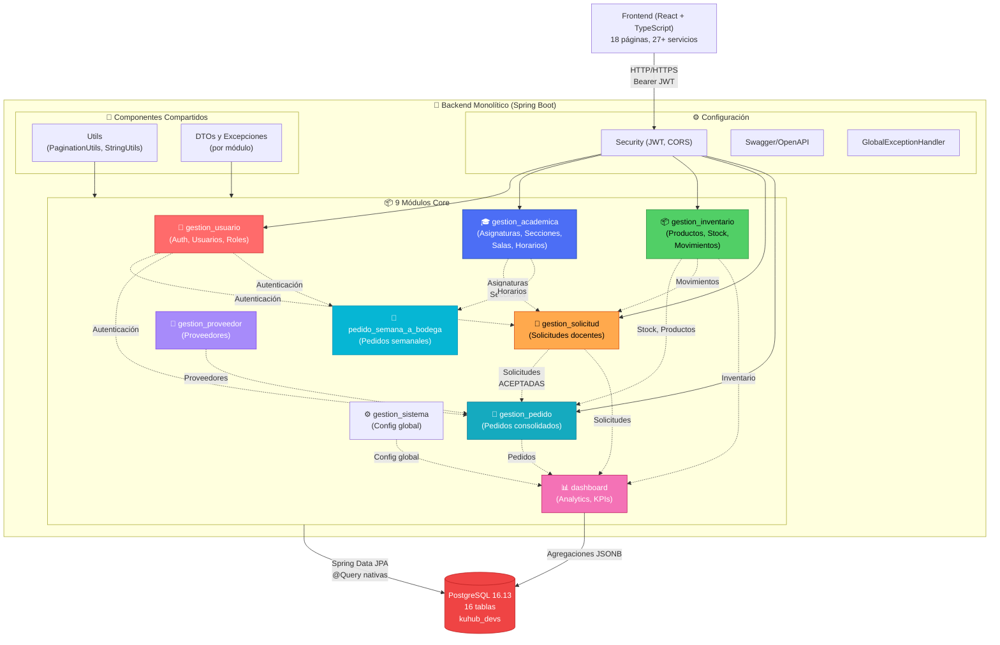

### 4.4 Diagrama: Arquitectura Frontend (React + TypeScript)

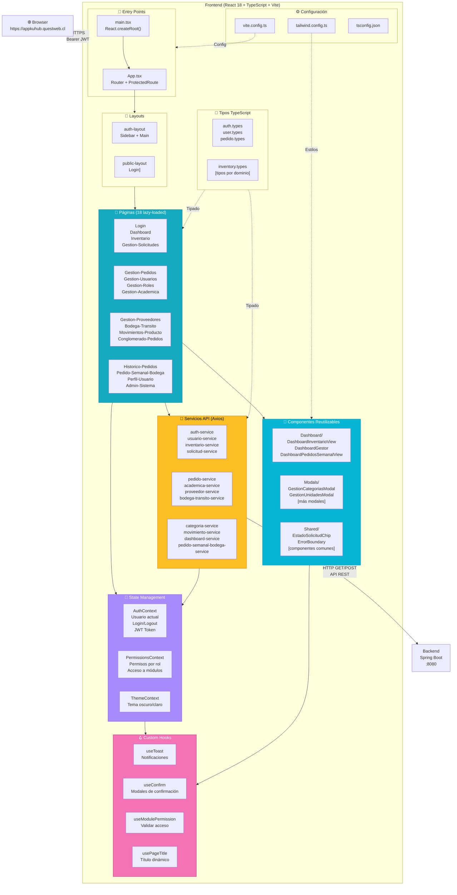

### 4.5 Flujo de Datos: Frontend → Backend

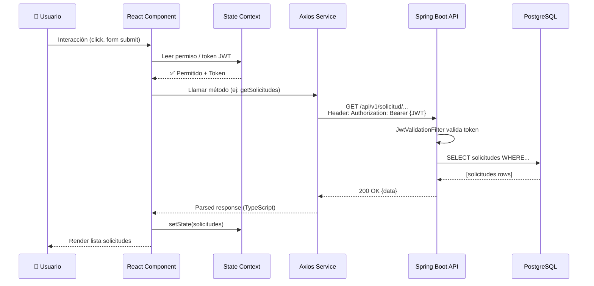

### Archivo editable

Descargar y editar: **`diagramas/4_vista_desarrollo.drawio`**

---

## 5. Vista de Escenarios

**Propósito**: Documentar los casos de uso principales y la matriz de permisos por rol.  
**Audiencia**: Product owners, testers, stakeholders, desarrolladores.

> 🔄 **IMPORTANTE**: El sistema de gestión de roles es **DINÁMICO**. Los roles y permisos descritos a continuación son la **configuración predeterminada**. Un Administrador puede modificar en tiempo real los permisos de cada rol desde la página `/gestion-roles`. Para restaurar los permisos originales, existe una función de reset que carga los valores predeterminados documentados aquí.

---

### 📋 5.0 Matriz de Acceso — Roles vs Páginas (Configuración Predeterminada)

**7 Roles del Sistema** con permisos dinámicos sobre **13 páginas principales**:

| Rol | Dashboard | Solicitud | Gestion Solicitudes | Gestion Pedidos | Conglomerado Pedidos | Inventario | Movimientos | Bodega Tránsito | Gestion Proveedores | Gestion Académica | Gestion Roles | Gestion Usuarios | Admin Sistema |
|---|:---:|:---:|:---:|:---:|:---:|:---:|:---:|:---:|:---:|:---:|:---:|:---:|:---:|
| **Administrador** | ✅ | ✅ | ✅ | ✅ | ✅ | ✅ | ✅ | ✅ | ✅ | ✅ | ✅ | ✅ | ✅ |
| **Co-Administrador** | ✅ | ✅ | ✅ | ✅ | ✅ | ✅ | ✅ | ✅ | ✅ | ✅ | ❌ | ❌ | ❌ |
| **Gestor de Pedidos** | ✅ | ❌ | ✅ | ✅ | ✅ | ❌ | ❌ | ❌ | ❌ | ❌ | ❌ | ❌ | ❌ |
| **Profesor a Cargo** | ✅ | ✅ CR | ❌ | ❌ | ❌ | ❌ | ❌ | ❌ | ❌ | ❌ | ❌ | ❌ | ❌ |
| **Docente** | ✅ | 📖 RO | ❌ | ❌ | ❌ | ❌ | ❌ | ❌ | ❌ | ❌ | ❌ | ❌ | ❌ |
| **Encargado de Bodega** | ✅ | ❌ | ❌ | ❌ | ❌ | ✅ | ✅ | ✅ | ❌ | ❌ | ❌ | ❌ | ❌ |
| **Asistente de Bodega** | ✅ | ❌ | ❌ | ❌ | ❌ | ❌ | ✅ | ✅ | ❌ | ❌ | ❌ | ❌ | ❌ |

**Leyenda:**
- ✅ = Acceso total (puede ver, crear, editar)
- ✅ CR = Acceso con permisos de Crear (puedeCrear + puedeActualizar)
- 📖 RO = Acceso Read-Only (solo lectura, no puede crear ni editar)
- ❌ = Acceso denegado (página no visible en menú, ruta protegida)

---

### 📊 5.1 Permisos por Rol — Descripción Detallada

#### 1️⃣ **Administrador** (ID: 1)
**Acceso Total**: Todas las páginas  
**Responsabilidades**:
- Gestión completa del sistema
- Crear/editar/eliminar usuarios y asignar roles
- Configurar matriz de permisos global
- Administrar horarios, semanas académicas y salas
- Acceso a todos los reportes y dashboards

**Páginas**: 13/13 disponibles

---

#### 2️⃣ **Co-Administrador** (ID: 2)
**Acceso Parcial**: Todas las páginas **excepto** Gestion Roles, Gestion Usuarios, Admin Sistema  
**Responsabilidades**:
- Supervisión de operaciones diarias
- Gestión de proveedores y académica
- Consolidación y confirmación de pedidos
- Análisis de inventario

**Páginas**: 10/13 disponibles  
**Restricciones**: No puede cambiar usuarios/roles ni configuración del sistema

---

#### 3️⃣ **Gestor de Pedidos** (ID: 3)
**Acceso Limitado**: Solo operaciones de pedidos  
**Responsabilidades**:
- Revisar y aceptar/rechazar solicitudes de docentes
- Consolidar pedidos semanales
- Crear conglomerados de pedidos
- Visualizar dashboard de procesos

**Páginas**: 4/13 disponibles
- ✅ Dashboard (ver KPIs de solicitudes/pedidos)
- ✅ Gestión de Solicitudes (revisar y cambiar estado)
- ✅ Gestión de Pedidos (crear y consolidar)
- ✅ Conglomerado de Pedidos (agrupar ordenes)

---

#### 4️⃣ **Profesor a Cargo** (ID: 4)
**Acceso Mínimo**: Creación de solicitudes  
**Responsabilidades**:
- ✅ **Crear** solicitudes de ingredientes para sus clases
- Seleccionar asignatura, sección y pedido semanal a bodega
- Definir cantidades según estudiantes inscritos
- Registrar observaciones especiales (alergias, preferencias)

**Páginas**: 3/13 disponibles
- ✅ Dashboard (estadísticas generales)
- ✅ Solicitud (crear/editar propias solicitudes)
- ✅ Gestion Recetas (consultar opciones)

**Permisos en módulos**:
- `DASHBOARD.puedeLeer` ✅
- `SOLICITUD.puedeLeer` ✅ + `SOLICITUD.puedeCrear` ✅ + `SOLICITUD.puedeActualizar` ✅
- `GESTION_RECETAS.puedeLeer` ✅

---

#### 5️⃣ **Docente** (ID: 5)
**Acceso Limitado**: Solo lectura de solicitudes  
**Responsabilidades**:
- 📖 **Consultar** solicitudes (ver estado, historial)
- Ver opciones de solicitud disponibles
- ❌ **NO puede crear** nuevas solicitudes (solo lectura)

**Páginas**: 3/13 disponibles (acceso igual pero sin permisos de escritura)
- ✅ Dashboard (estadísticas generales)
- ✅ Solicitud (lectura, sin crear)
- ✅ Gestion Recetas (consultar)

**Permisos en módulos**:
- `DASHBOARD.puedeLeer` ✅
- `SOLICITUD.puedeLeer` ✅ (NO create/update/delete)
- `GESTION_RECETAS.puedeLeer` ✅

**Diferencia clave con Profesor a Cargo**: El Docente NO tiene `puedeCrear` en SOLICITUD

---

#### 6️⃣ **Encargado de Bodega** (ID: 6)
**Acceso Especializado**: Gestión de inventario  
**Responsabilidades**:
- Recibir productos en bodega de tránsito
- Registrar movimientos de entrada/salida
- Consultar inventario actual
- Revisar histórico de movimientos

**Páginas**: 4/13 disponibles
- ✅ Dashboard (KPIs de bodega)
- ✅ Inventario (ver stock actual, no editar)
- ✅ Historial/Movimientos (registro detallado)
- ✅ Bodega de Tránsito (recibir y registrar ingresos)

---

#### 7️⃣ **Asistente de Bodega** (ID: 7)
**Acceso Limitado**: Solo apoyo en bodega  
**Responsabilidades**:
- Ayuda en recepción de productos
- Consultar movimientos (solo lectura)
- Registrar cambios manuales de estado

**Páginas**: 3/13 disponibles
- ✅ Dashboard (información general)
- ✅ Historial/Movimientos (lectura)
- ✅ Bodega de Tránsito (registrar ingresos)

---

### 5.2 Caso de Uso: Profesor a Cargo crea solicitud de ingredientes

**Rol que puede ejecutar**: SOLO Profesor a Cargo (ID: 4)  
**Página requerida**: `/solicitud` (pageId: `solicitud`)  
**Permisos validados**: `SOLICITUD.puedeCrear = true`

> ⚠️ **Nota importante**: El rol **Docente** (ID: 5) SOLO tiene permisos de lectura (`puedeLeer`), NO puede crear nuevas solicitudes.

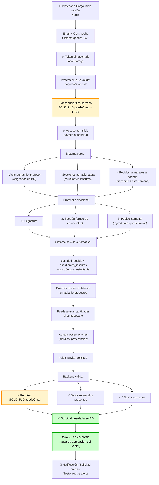

**Diagrama de secuencia — Validación de permisos**:

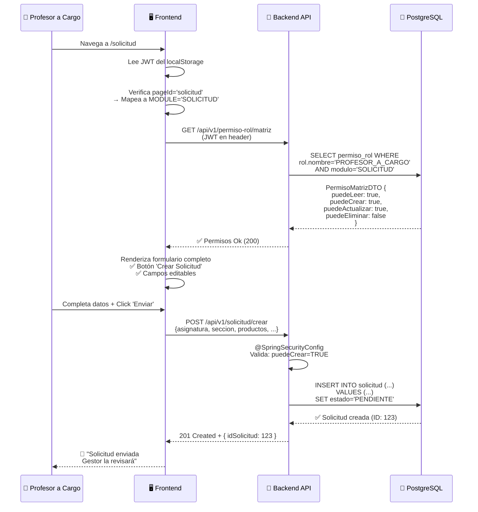

**Comparación de permisos — Profesor vs Docente**:

| Acción | Profesor a Cargo | Docente |
|---|---|---|
| Ver página `/solicitud` | ✅ Acceso | ✅ Acceso |
| Ver solicitudes existentes | ✅ `puedeLeer` | ✅ `puedeLeer` |
| Crear nueva solicitud | ✅ `puedeCrear` | ❌ `puedeCrear = FALSE` |
| Editar propia solicitud | ✅ `puedeActualizar` | ❌ `puedeActualizar = FALSE` |
| Eliminar solicitud | ❌ `puedeEliminar = FALSE` | ❌ `puedeEliminar = FALSE` |

### 5.3 Caso de Uso: Gestor consolida solicitudes y crea pedidos

**Rol requerido**: Gestor de Pedidos (ID: 3)  
**Páginas requeridas**: `/gestion-solicitudes` + `/gestion-pedidos` + `/conglomerado-pedidos`  
**Permisos validados**: 
- `GESTION_SOLICITUDES.puedeActualizar` (cambiar estado)
- `GESTION_PEDIDOS.puedeCrear` (crear pedido consolidado)

```mermaid
graph TD
    A["👤 Gestor de Pedidos inicia sesión"]
    A_perm["ProtectedRoute valida:<br/>pageId='gestion-solicitudes'"]
    B["Navega a /gestion-solicitudes"]
    C["Selector de Semana Activa<br/>ej. Semana 5: 2 - 9 de mayo"]
    D["Sistema carga solicitudes"]
    D_perm["Backend verifica:<br/>GESTION_SOLICITUDES.puedeLeer"]
    E["Agrupa por Asignatura:<br/>Gastronomía, Repostería, etc."]
    F["Expande y revisa solicitudes"]
    G["Solicitud card muestra:<br/>- Docente X<br/>- Sección A (12 estudiantes)<br/>- Productos solicitados"]
    H["Gestor selecciona múltiples<br/>(bulk action)"]
    I["Cambia estado: PENDIENTE → ACEPTADA"]
    I_perm["Backend verifica:<br/>GESTION_SOLICITUDES.puedeActualizar"]
    J["Sistema actualiza estado en BD"]
    K["Gestor navega a /gestion-pedidos"]
    L["Selector de Semana<br/>(misma semana)"]
    M["Sistema agrupa solicitudes<br/>ACEPTADAS por Producto"]
    M_perm["Backend verifica:<br/>GESTION_PEDIDOS.puedeLeer"]
    N["Tabla consolidada:<br/>Producto | Qty Total | Secciones"]
    O["Ejemplo:<br/>Tomate: 45kg<br/>(Secc A: 15kg, B: 20kg, C: 10kg)"]
    P["Revisa cantidades y costos"]
    Q["Pulsa 'Crear Pedido Consolidado'"]
    R["Backend valida:<br/>GESTION_PEDIDOS.puedeCrear"]
    S["Sistema crea PEDIDO oficial"]
    T["Estado: BORRADOR<br/>(editable antes de confirmar)"]
    U["Admin o Co-Admin confirma<br/>botón 'Confirmar Pedido'"]
    V["✅ Pedido CONFIRMADO"]
    W["Se marca como enviado a bodega<br/>y se notifica al Encargado"]

    A --> A_perm
    A_perm --> B
    B --> C
    C --> D
    D --> D_perm
    D_perm --> E
    E --> F
    F --> G
    G --> H
    H --> I
    I --> I_perm
    I_perm --> J
    J --> K
    K --> L
    L --> M
    M --> M_perm
    M_perm --> N
    N --> O
    O --> P
    P --> Q
    Q --> R
    R --> S
    S --> T
    T --> U
    U --> V
    V --> W

    style A_perm fill:#fff4cc,stroke:#ff9800,color:#000,stroke-width:2px
    style D_perm fill:#fff4cc,stroke:#ff9800,color:#000,stroke-width:2px
    style I_perm fill:#fff4cc,stroke:#ff9800,color:#000,stroke-width:2px
    style M_perm fill:#fff4cc,stroke:#ff9800,color:#000,stroke-width:2px
    style R fill:#fff4cc,stroke:#ff9800,color:#000,stroke-width:2px
    style V fill:#ccffcc,stroke:#00aa00,color:#000,stroke-width:3px
    style W fill:#ccffcc,stroke:#00aa00,color:#000,stroke-width:3px
```

**Flujo de permisos** — Validaciones en cada paso:

| Paso | Acción | Permiso requerido | Validación |
|---|---|---|---|
| 1 | Acceder a `/gestion-solicitudes` | `GESTION_SOLICITUDES.puedeLeer` | ProtectedRoute + Backend |
| 2 | Cambiar estado de solicitud | `GESTION_SOLICITUDES.puedeActualizar` | PATCH /api/v1/solicitud/{id} |
| 3 | Ver `/gestion-pedidos` | `GESTION_PEDIDOS.puedeLeer` | ProtectedRoute + Backend |
| 4 | Crear pedido consolidado | `GESTION_PEDIDOS.puedeCrear` | POST /api/v1/pedido/crear |
| 5 | Confirmar pedido | Requiere rol **Administrador** o **Co-Administrador** | Validación en backend |

### 5.4 Caso de Uso: Encargado bodega recibe y registra productos

**Rol requerido**: Encargado de Bodega (ID: 6) o Asistente (ID: 7)  
**Página requerida**: `/bodega-transito`  
**Permisos validados**: `BODEGA_TRANSITO.puedeActualizar` (registrar ingreso)

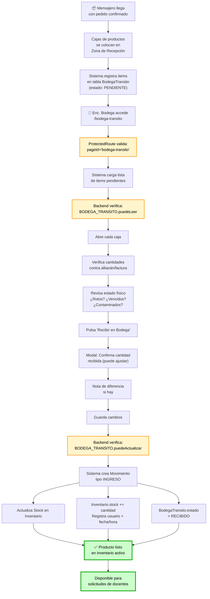

**Cambios de estado en el flujo**:

```
BodegaTransito
├─ PENDIENTE (recién llega)
│  └─ Enc. Bodega revisa y confirma
└─ RECIBIDO (confirmado, pasa a Inventario)
     └─ Producto disponible para usos
```

**Permisos por rol en esta página**:

| Rol | Acceso | Puede crear | Puede leer | Puede actualizar |
|---|---|---|---|---|
| **Encargado de Bodega** | ✅ Sí | ❌ No | ✅ Sí | ✅ Sí |
| **Asistente de Bodega** | ✅ Sí | ❌ No | ✅ Sí | ✅ Sí |
| **Otros roles** | ❌ No | ❌ No | ❌ No | ❌ No |

---

### 5.5 Caso de Uso: Docente consulta estado de solicitudes

**Rol que puede ejecutar**: Docente (ID: 5)  
**Página requerida**: `/solicitud` (pageId: `solicitud`)  
**Permisos validados**: `SOLICITUD.puedeLeer = true` (lectura solamente)

> ⚠️ **Diferencia con Profesor a Cargo**: El Docente solo PUEDE LEER solicitudes, NO puede crear nuevas.

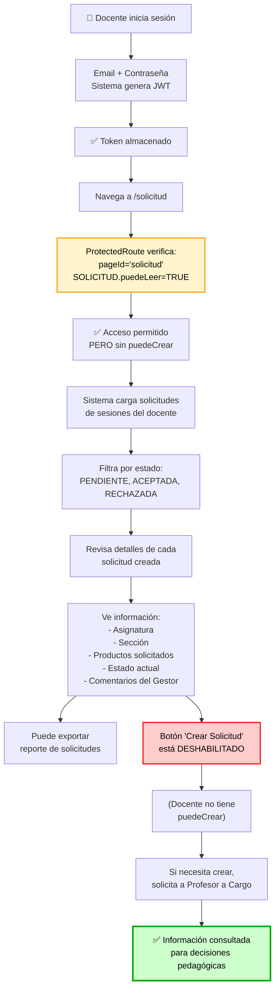

**Matriz de permisos — Docente en módulo SOLICITUD**:

| Acción | Disponible | Detalles |
|---|---|---|
| Ver solicitudes | ✅ Sí | `puedeLeer = TRUE` |
| Crear solicitud | ❌ No | `puedeCrear = FALSE` |
| Editar solicitud | ❌ No | `puedeActualizar = FALSE` |
| Eliminar solicitud | ❌ No | `puedeEliminar = FALSE` |
| Exportar reporte | ✅ Sí | Función de lectura |

---

### 5.6 Caso de Uso: Asistente de Bodega apoya en recepción de productos

**Rol que puede ejecutar**: Asistente de Bodega (ID: 7)  
**Página requerida**: `/bodega-transito`  
**Permisos validados**: `BODEGA_TRANSITO.puedeCrear + puedeActualizar` (crear y editar)

> 📌 **Diferencia con Encargado**: El Asistente tiene permisos similares pero reporta al Encargado.

```mermaid
graph TD
    A["👤 Asistente de Bodega<br/>inicia sesión"]
    B["Navega a /bodega-transito"]
    B_perm["ProtectedRoute verifica:<br/>pageId='bodega-transito'"]
    C["✅ Acceso permitido"]
    D["Sistema carga lista de<br/>productos pendientes<br/>de confirmar"]
    E["Recibe instrucciones del<br/>Encargado de Bodega"]
    F["Abre cajas de recepción"]
    G["Verifica cantidades<br/>básicas con albarán"]
    H["Puede registrar estado<br/>físico inicial"]
    I["Pulsa 'Registrar Recepción'"]
    I_perm["Backend verifica:<br/>BODEGA_TRANSITO.puedeCrear"]
    J["Completa datos:<br/>cantidad recibida<br/>observaciones"]
    K["Guarda cambios"]
    L["Encargado revisa<br/>y confirma"]
    M["Sistema actualiza<br/>BodegaTransito.estado<br/>= VERIFICADO"]
    N["✅ Producto registrado<br/>aguardando confirmación final"]

    A --> B
    B --> B_perm
    B_perm --> C
    C --> D
    D --> E
    E --> F
    F --> G
    G --> H
    H --> I
    I --> I_perm
    I_perm --> J
    J --> K
    K --> L
    L --> M
    M --> N

    style B_perm fill:#fff4cc,stroke:#ff9800,color:#000,stroke-width:2px
    style I_perm fill:#fff4cc,stroke:#ff9800,color:#000,stroke-width:2px
    style L fill:#e6f3ff,stroke:#2196F3,color:#000,stroke-width:2px
    style N fill:#ccffcc,stroke:#00aa00,color:#000,stroke-width:3px
```

**Responsabilidades del Asistente**:
- ✅ Ayudar en verificación física de productos
- ✅ Registrar cantidades iniciales
- ✅ Documentar daños o discrepancias
- ✅ Crear registros de movimientos
- ❌ NO puede confirmar recepción final (solo Encargado)
- ❌ NO puede eliminar registros

---

### 5.7 Caso de Uso: Co-Administrador supervisa operaciones

**Rol que puede ejecutar**: Co-Administrador (ID: 2)  
**Páginas principales**: `/dashboard`, `/gestion-solicitudes`, `/gestion-pedidos`, `/inventario`  
**Permisos validados**: 
- ✅ Todos los módulos operativos
- ❌ EXCEPTO: `GESTION_ROLES`, `ADMIN_SISTEMA`, `GESTION_USUARIOS`

```mermaid
graph TD
    A["👤 Co-Administrador<br/>inicia sesión"]
    B["Navega a /dashboard"]
    B_perm["ProtectedRoute verifica:<br/>Acceso a módulos operativos<br/>EXCEPTO Admin"]
    C["✅ Acceso permitido"]
    D["Visualiza dashboard<br/>con 3 tabs principales"]
    E["📊 Tab 1: Inventario"]
    E1["Stock actual por categoría"]
    E2["Productos críticos"]
    F["📊 Tab 2: Solicitudes"]
    F1["Solicitudes por semana<br/>Estado: Pendiente/Aceptada"]
    G["📊 Tab 3: Pedidos"]
    G1["Pedidos consolidados<br/>Costo estimado"]
    H["Puede navegar a<br/>/gestion-solicitudes"]
    H1["Revisar y cambiar<br/>estado de solicitudes"]
    I["Puede navegar a<br/>/gestion-pedidos"]
    I1["Crear pedidos consolidados<br/>Confirmar pedidos"]
    J["Puede navegar a<br/>/inventario"]
    J1["Ver y editar productos<br/>Gestionar categorías"]
    K["❌ RESTRICCIONES"]
    L1["NO: /gestion-roles"]
    L2["NO: /gestion-usuarios"]
    L3["NO: /admin-sistema"]
    M["🎯 Resultado: Supervisión<br/>operativa completa"]

    A --> B
    B --> B_perm
    B_perm --> C
    C --> D
    D --> E
    D --> F
    D --> G
    E --> E1
    E --> E2
    F --> F1
    G --> G1
    D --> H
    H --> H1
    D --> I
    I --> I1
    D --> J
    J --> J1
    D --> K
    K --> L1
    K --> L2
    K --> L3
    H1 --> M
    I1 --> M
    J1 --> M

    style B_perm fill:#fff4cc,stroke:#ff9800,color:#000,stroke-width:2px
    style K fill:#ffcccc,stroke:#ff0000,color:#000,stroke-width:2px
    style M fill:#ccffcc,stroke:#00aa00,color:#000,stroke-width:3px
```

**Comparativa: Admin vs Co-Admin**:

| Aspecto | Administrador | Co-Administrador |
|---|---|---|
| **Gestión de Solicitudes** | ✅ Sí | ✅ Sí |
| **Gestión de Pedidos** | ✅ Sí | ✅ Sí |
| **Inventario** | ✅ CRUD completo | ✅ Crear/Editar (sin eliminar) |
| **Gestión de Roles** | ✅ Sí | ❌ NO |
| **Gestión de Usuarios** | ✅ Sí | ❌ NO |
| **Admin del Sistema** | ✅ Sí | ❌ NO |

---

### 5.8 Caso de Uso: Administrador visualiza dashboards y reportes

**Rol requerido**: Administrador (ID: 1) o Co-Administrador (ID: 2)  
**Página requerida**: `/dashboard`  
**Permisos validados**: `DASHBOARD.puedeLeer` (acceso a todos los tabs según rol)

```mermaid
graph TD
    A["👤 Administrador inicia sesión"]
    B["Accede a /dashboard"]
    B_perm["ProtectedRoute verifica:<br/>pageId='dashboard'"]
    C["Sistema detecta rol<br/>y permisos"]
    D["Backend calcula<br/>tabs disponibles"]
    D_perm["Según rol:<br/>- Admin: 4 tabs<br/>- Co-Admin: 3 tabs"]
    E["📊 Tab 1: Inventario"]
    E1["Gráfico: Stock por categoría"]
    E2["Tabla: Productos críticos<br/>(stock bajo)"]
    E3["Histórico: Movimientos<br/>últimos 7 días"]
    F["📊 Tab 2: Solicitudes"]
    F1["KPI: Pendientes vs Aceptadas<br/>vs Rechazadas"]
    F2["Tabla: Solicitudes por semana"]
    F3["Filtro: Por estado, asignatura"]
    G["📊 Tab 3: Pedidos"]
    G1["KPI: Pedidos por semana"]
    G2["Costo total estimado"]
    G3["Ingredientes más solicitados"]
    H["📊 Tab 4: Administración<br/>(Solo Admin)"]
    H1["Usuarios activos/inactivos"]
    H2["Cambios recientes"]
    H3["Auditoría de permisos"]
    I["Admin interactúa:<br/>Selecciona filtros"]
    J["Rango de fechas"]
    K["Asignatura / Sección"]
    L["Estado de solicitud"]
    M["Sistema recalcula<br/>en tiempo real"]
    N["Gráficos y tablas<br/>se actualizan"]
    O["Puede exportar reporte"]
    O1["PDF con gráficos"]
    O2["Excel con tablas detalladas"]
    P["🎉 Datos disponibles para<br/>decisiones estratégicas"]

    A --> B
    B --> B_perm
    B_perm --> C
    C --> D
    D --> D_perm
    D_perm --> E
    D_perm --> F
    D_perm --> G
    D_perm --> H
    E --> E1
    E --> E2
    E --> E3
    F --> F1
    F --> F2
    F --> F3
    G --> G1
    G --> G2
    G --> G3
    H --> H1
    H --> H2
    H --> H3
    E1 --> I
    E2 --> I
    E3 --> I
    F1 --> I
    F2 --> I
    F3 --> I
    G1 --> I
    I --> J
    I --> K
    I --> L
    J --> M
    K --> M
    L --> M
    M --> N
    N --> O
    O --> O1
    O --> O2
    O1 --> P
    O2 --> P

    style B_perm fill:#fff4cc,stroke:#ff9800,color:#000,stroke-width:2px
    style D_perm fill:#fff4cc,stroke:#ff9800,color:#000,stroke-width:2px
    style H fill:#e6f3ff,stroke:#2196F3,color:#000,stroke-width:2px
    style P fill:#ccffcc,stroke:#00aa00,color:#000,stroke-width:3px
```

**Diferencias en dashboards por rol**:

| Aspecto | Admin | Co-Admin | Gestor | Bodega |
|---|---|---|---|---|
| **Tab Inventario** | ✅ Completo | ✅ Completo | ❌ No | ✅ Básico |
| **Tab Solicitudes** | ✅ Completo | ✅ Completo | ✅ Completo | ❌ No |
| **Tab Pedidos** | ✅ Completo | ✅ Completo | ✅ Completo | ❌ No |
| **Tab Administración** | ✅ Usuarios, Auditoría, Cambios | ❌ No acceso | ❌ No acceso | ❌ No acceso |
| **Exportar reportes** | ✅ PDF/Excel | ✅ PDF/Excel | ✅ PDF/Excel | ✅ PDF/Excel |

---

### 5.9 Resumen de Restricciones por Rol

#### 🔴 Restricciones Comunes

| Restricción | Detalles |
|---|---|
| **Acceso vía ProtectedRoute** | Cada página valida `pageId` contra matriz de permisos. Si acceso denegado → redirige a `/sin-acceso` |
| **Validación backend** | TODO endpoint requiere JWT válido en header `Authorization: Bearer <token>` |
| **Control de módulos** | Tabla `permiso_rol` mapea cada rol a módulos (1-to-many). Permisos CRUD son booleanos |
| **Eliminación lógica** | Todos los datos se marcan `activo = false`, nunca se eliminan permanentemente |
| **Auditoría** | Cada cambio registra usuario, timestamp y tipo de operación |

#### 🟢 Acceso Permitido por Página

```
✅ DASHBOARD
  ├─ Administrador (todos los tabs)
  ├─ Co-Administrador (sin tab Administración)
  ├─ Gestor de Pedidos (solo KPIs de pedidos)
  ├─ Profesor/Docente (resumen general)
  ├─ Encargado Bodega (KPIs de inventario)
  └─ Asistente Bodega (información general)

✅ SOLICITUD (crear)
  ├─ Docente
  └─ Profesor a Cargo

✅ GESTION_SOLICITUDES (revisar/aprobar)
  ├─ Administrador
  ├─ Co-Administrador
  └─ Gestor de Pedidos

✅ GESTION_PEDIDOS (crear/consolidar)
  ├─ Administrador
  ├─ Co-Administrador
  └─ Gestor de Pedidos

✅ INVENTARIO (consultar/editar)
  ├─ Administrador
  ├─ Co-Administrador
  ├─ Encargado Bodega (lectura)
  └─ Asistente Bodega (lectura)

✅ BODEGA_TRANSITO (recibir productos)
  ├─ Administrador
  ├─ Co-Administrador
  ├─ Encargado Bodega
  └─ Asistente Bodega

✅ GESTION_ROLES (administrar permisos)
  └─ Administrador (solo)

✅ GESTION_USUARIOS (crear/editar usuarios)
  └─ Administrador (solo)

✅ ADMIN_SISTEMA (configuración global)
  └─ Administrador (solo)
```

---

### 5.10 Gestión Dinámica de Permisos — Cómo Restaurar Predeterminados

**El sistema permite a los Administradores cambiar los permisos en tiempo real** desde `/gestion-roles`. 

#### Página: Gestión de Roles (`/gestion-roles`)

```
┌─────────────────────────────────────────────────────────────┐
│ GESTIÓN DE ROLES — Panel de Administración                  │
├─────────────────────────────────────────────────────────────┤
│                                                              │
│ Rol: [Dropdown]  Módulo: [Dropdown]  [Buscar]              │
│ [Restaurar configuración predeterminada]  [Guardar cambios] │
│                                                              │
│ ┌─ Matriz de Permisos ────────────────────────────────────┐ │
│ │ Módulo            │ Leer │ Crear │ Actualizar │ Eliminar │ │
│ │ SOLICITUD         │  ☑   │  ☑    │    ☑       │    ☐     │ │
│ │ INVENTARIO        │  ☑   │  ☐    │    ☐       │    ☐     │ │
│ │ BODEGA_TRANSITO   │  ☑   │  ☑    │    ☐       │    ☐     │ │
│ │ ...               │  -   │  -    │    -       │    -     │ │
│ └─────────────────────────────────────────────────────────┘ │
│                                                              │
│ [Guardar Cambios]  [Restaurar Predeterminados]             │
│                                                              │
└─────────────────────────────────────────────────────────────┘
```

#### Cómo restaurar permisos a valores originales:

1. **Via UI** → `/gestion-roles`
   - Ir a la página de Gestión de Roles
   - Seleccionar el rol (ej: "PROFESOR_A_CARGO")
   - Click en botón "Restaurar Predeterminados"
   - Se cargan automáticamente los permisos originales
   - Click "Guardar Cambios"

2. **Via SQL** (si es necesario)
   - Ejecutar el bloque de permisos correspondiente en `ConexionXD_v2.sql` (líneas 825-1096)
   - Ej: Para restaurar todos los roles, ejecutar desde línea 841 a línea 928

#### Permisos que pueden ser modificados:

Cualquier combinación de:
- ✅ `puede_leer` (lectura)
- ✅ `puede_crear` (crear registros)
- ✅ `puede_actualizar` (editar registros)
- ✅ `puede_eliminar` (eliminar/desactivar registros)

**Nota**: Aunque los permisos se pueden cambiar dinámicamente, se recomienda mantener la estructura predeterminada documentada en esta sección para garantizar la integridad del flujo de negocio.

---

### Archivo editable

Descargar y editar: **`diagramas/5_vista_escenarios.drawio`**

---

## 📌 Resumen Comparativo de Vistas

| Vista | Foco | Audiencia | Cambio frecuencia |
|---|---|---|---|
| **Lógica** | Componentes y responsabilidades | Arquitectos, devs | Medio (cambios en módulos) |
| **Procesos** | Flujos y interacciones | PO, QA, backend devs | Bajo (procesos estables) |
| **Física** | Infraestructura y despliegue | DevOps, SRE, infra | Bajo (cambios ocasionales) |
| **Desarrollo** | Estructura del código | Developers | Alto (cambios continuos) |
| **Escenarios** | Casos de uso principales | Stakeholders, QA, PO | Bajo (UA estables) |

---

## 🔗 Cómo usar estos diagramas

1. **Para aprender la arquitectura**:
   - Leer Vista Lógica → Procesos → Escenarios

2. **Para onboarding de nuevos developers**:
   - Mostrar Vista de Desarrollo + Estructura de código

3. **Para decisiones técnicas**:
   - Consultar Vista Física + Vista de Procesos

4. **Para documentación de stakeholders**:
   - Compartir Vista de Escenarios + Lógica

5. **Para editar los diagramas**:
   - Descargar archivos `.drawio` de la carpeta `/diagramas/`
   - Abrir en [draw.io](https://draw.io) o aplicación de escritorio
   - Realizar cambios
   - Exportar a PNG/SVG y actualizar aquí

---

**Última actualización**: 12 de mayo de 2026  
**Responsable**: Equipo de Arquitectura  
**Versión**: 1.0.0

