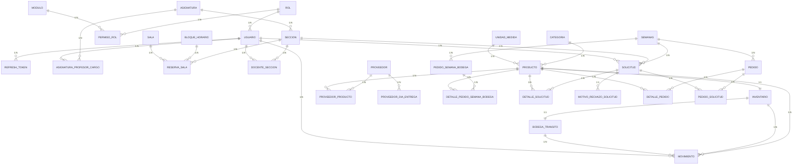

# 📊 DIAGRAMA ENTIDAD-RELACIÓN (ER) — KuHub v1.0.8

**Fecha:** 2026-05-12  
**Versión del Sistema:** 1.0.8  
**Base de Datos:** PostgreSQL 16.13  
**Archivo SQL Base:** ConexionXD_v2.sql (líneas 200-1215)

---

## 📑 ÍNDICE DE CONTENIDOS

1. [Estructura General](#1-estructura-general)
2. [Diagrama ER Completo (Mermaid)](#2-diagrama-er-completo-mermaid)
3. [Lista de Tablas por Módulo](#3-lista-de-tablas-por-módulo)
4. [Diagramas ASCII Detallados](#4-diagramas-ascii-detallados)
5. [Relaciones Clave](#5-relaciones-clave)
6. [Restricciones y Validaciones](#6-restricciones-y-validaciones)
7. [Particionamiento](#7-particionamiento)
8. [Índices](#8-índices)
9. [Funciones SQL y Triggers](#9-funciones-sql-y-triggers)
10. [Tipos ENUM](#10-tipos-enum)
11. [Módulo M:M y Configuración](#11-módulo-mm-y-configuración)
12. [Módulo de Pedido Semanal a Bodega](#12-módulo-de-pedido-semanal-a-bodega)
13. [Módulo de Solicitudes](#13-módulo-de-solicitudes)
14. [Módulo de Pedidos](#14-módulo-de-pedidos)
15. [Sistema de Permisos](#15-sistema-de-permisos)

---

## 1. ESTRUCTURA GENERAL

KuHub está compuesto por **9 módulos principales** con **38 tablas totales**:

### Módulos del Sistema

| Módulo | Tablas | Descripción |
|--------|--------|-------------|
| **🔐 Seguridad** | 5 | usuario, rol, refresh_token, modulo, permiso_rol |
| **🎓 Académico** | 7 | asignatura, seccion, bloque_horario, sala, reserva_sala, docente_seccion, asignatura_profesor_cargo |
| **📦 Inventario** | 6 | unidad_medida, categoria, producto, inventario, bodega_transito, movimiento* |
| **🚚 Proveedores** | 3 | proveedor, proveedor_producto, proveedor_dia_entrega |
| **📦 Pedido Semanal a Bodega** | 2 | pedido_semana_bodega, detalle_pedido_semana_bodega |
| **🛒 Solicitudes** | 3 | solicitud, detalle_solicitud, motivo_rechazo_solicitud |
| **📝 Pedidos** | 3 | pedido, detalle_pedido, pedido_solicitud |
| **⚙️ Configuración** | 2 | gestion_sistema, semanas |
| **TOTAL** | **38** | |

---

## 2. DIAGRAMA ER COMPLETO (MERMAID)



---

## 3. LISTA DE TABLAS POR MÓDULO

### 3.1 MÓDULO SEGURIDAD (5 tablas)

| Tabla | Tipo | Descripción |
|-------|------|-------------|
| **rol** | Entidad | 7 roles del sistema |
| **usuario** | Entidad | Usuarios del sistema |
| **refresh_token** | Entidad | Tokens JWT refresh |
| **modulo** | Entidad | Módulos del sistema (Hibernate) |
| **permiso_rol** | Puente M:M | Matriz CRUD Rol×Módulo |

### 3.2 MÓDULO ACADÉMICO (7 tablas)

| Tabla | Tipo | Descripción |
|-------|------|-------------|
| **asignatura** | Entidad | Cursos/Asignaturas |
| **bloque_horario** | Entidad | 20 franjas horarias (39 min c/u) |
| **sala** | Entidad | Salas de clase |
| **seccion** | Entidad | Secciones de asignatura |
| **reserva_sala** | Entidad | Reservas de sala |
| **docente_seccion** | Puente M:M | Asignación docentes a secciones |
| **asignatura_profesor_cargo** | Puente M:M | Profesor a cargo de asignatura |

### 3.3 MÓDULO INVENTARIO (6 tablas)

| Tabla | Tipo | Descripción |
|-------|------|-------------|
| **unidad_medida** | Entidad | kg, L, unidades, etc. |
| **categoria** | Entidad | Categorías de productos |
| **producto** | Entidad | Productos del inventario |
| **inventario** | Entidad | Stock por producto (1:1) |
| **bodega_transito** | Entidad | Stock en tránsito (1:1) |
| **movimiento*** | Entidad | Historial (PARTICIONADO por semestre) |

### 3.4 MÓDULO PROVEEDORES (3 tablas — LÓGICA DEL NEGOCIO)

| Tabla | Tipo | Descripción |
|-------|------|-------------|
| **proveedor** | Entidad | Proveedores/Distribuidoras |
| **proveedor_producto** | Puente M:M | Proveedor↔Producto con precio (lógica de proveedores) |
| **proveedor_dia_entrega** | Entidad | Horarios de entrega |

### 3.5 MÓDULO CONFIGURACIÓN (2 tablas)

| Tabla | Tipo | Descripción |
|-------|------|-------------|
| **gestion_sistema** | Entidad | Configuración global (2 filas) |
| **semanas** | Entidad | Períodos académicos (18 por semestre) |

### 3.6 MÓDULO PEDIDO SEMANAL A BODEGA (2 tablas)

| Tabla | Tipo | Descripción |
|-------|------|-------------|
| **pedido_semana_bodega** | Entidad | Pedidos semanales a bodega (antigua tabla "receta") |
| **detalle_pedido_semana_bodega** | Entidad | Items del pedido semanal a bodega |

### 3.7 MÓDULO SOLICITUDES (3 tablas)

| Tabla | Tipo | Descripción |
|-------|------|-------------|
| **solicitud** | Entidad | Solicitudes de insumos |
| **detalle_solicitud** | Entidad | Items de solicitud |
| **motivo_rechazo_solicitud** | Entidad | Motivos de rechazo (1:1) |

### 3.8 MÓDULO PEDIDOS (3 tablas)

| Tabla | Tipo | Descripción |
|-------|------|-------------|
| **pedido** | Entidad | Pedidos operativos |
| **detalle_pedido** | Entidad | Items de pedido |
| **pedido_solicitud** | Puente M:M | Relación Pedido↔Solicitud |

---

## 4. DIAGRAMAS ASCII DETALLADOS

### 4.1 Núcleo de Seguridad

```
┌──────────────────────────────────────────────────────────────┐
│                       ROL                                    │
│ • id_rol (PK)                                                │
│ • nombre_rol (ENUM: ADMINISTRADOR, CO_ADMINISTRADOR, ...)    │
│ • activo (BOOLEAN)                                           │
└────────┬───────────────────────────────┬─────────────────────┘
         │ 1:N                           │ M:M via
         │ (usuario)                     │ (permiso_rol)
         │                               │
         ↓                               ↓
    ┌──────────────────────┐        ┌────────────────────┐
    │      USUARIO         │        │      MODULO        │
    │ • id_usuario (PK)    │        │ • id_modulo (PK)   │
    │ • id_rol (FK)        │        │ • codigo_modulo    │
    │ • email (UNIQUE)     │        │ • nombre_modulo    │
    │ • username (UNIQUE)  │        │ • descripcion      │
    │ • contrasena         │        │ • icono_modulo     │
    │ • nombres/apellidos  │        │ • orden_modulo     │
    │ • url_foto_perfil    │        │ • enabled          │
    │ • activo             │        │ • fecha_creacion   │
    │ • fecha_creacion     │        └────────┬───────────┘
    │ • ultimo_acceso      │                 │ N:M
    └────────┬─────────────┘                 │
             │ 1:N                           │
    ┌────────┴───────────────────────────────┴─────────────┐
    │                 │                                    │
    ↓                 ↓                                    ↓
┌──────────────┐  ┌────────────────────────────────────────┐
│REFRESH_TOKEN │  │   PERMISO_ROL (M:M)                    │
│ • id(PK)     │  │ • id_permiso_rol (PK)                  │
│ • id_usuario │  │ • id_rol (FK)                          │
│   (FK)       │  │ • id_modulo (FK)                       │
│ • token (U)  │  │ • puede_leer                           │
│ • creado_en  │  │ • puede_crear                          │
│ • expires_at │  │ • puede_actualizar                     │
└──────────────┘  │ • enabled                              │
                  │ • UNIQUE(rol,modulo)                   │
                  └────────────────────────────────────────┘
```

### 4.2 Módulo Académico

```
┌──────────────────────────────────────────────────────────────┐
│                    ASIGNATURA                                │
│ • id_asignatura (PK)                                         │
│ • cod_asignatura (UNIQUE, VARCHAR 50)                        │
│ • nombre_asignatura (VARCHAR 100)                            │
│ • descripcion (VARCHAR 250)                                  │
│ • activo (BOOLEAN)                                           │
└────────┬─────────────────────────────┬───────────────────────┘
         │ 1:N                         │ 1:1 (profesor a cargo)
         │                             │
         ↓                             ↓
    ┌─────────────────────────────────────────┐
    │        ASIGNATURA_PROFESOR_CARGO        │
    │ • id (PK)                               │
    │ • id_asignatura (FK, UNIQUE)            │
    │ • id_usuario (FK)                       │
    │ • fecha_asignacion (TIMESTAMP)          │
    └─────────────────────────────────────────┘
         ↑ N:1 (usuario)
         │
┌────────────────────────────────────────────────────────┐
│                    SECCION                             │
│ • id_seccion (PK)                                      │
│ • id_asignatura (FK)                                   │
│ • nombre_seccion (VARCHAR 100)                         │
│ • capacidad_max, cant_inscritos (SMALLINT)             │
│ • estado_seccion (ENUM: ACTIVA, INACTIVA, SUSPENDIDA)  │
│ • activo (BOOLEAN)                                     │
└────────┬──────────────────────────┬────────────────────┘
         │ 1:N (multiple)           │ 1:N (docentes)
    ┌────┴─────┐                    │
    │          │                    ↓
    ↓          ↓        ┌───────────────────────────────────┐
┌──────────────────┐    │    DOCENTE_SECCION (M:M)          │
│  RESERVA_SALA    │    │ • id_docente_seccion (PK)         │
│ • id_reserva(PK) │    │ • id_usuario (FK)                 │
│ • id_seccion(FK) │    │ • id_seccion (FK)                 │
│ • id_sala(FK) ──┐│    │ • fecha_asignacion                │
│ • dia_semana(E) ││    │ • UNIQUE(usuario, seccion)        │
│ • id_bloque(FK)─┼┼─┐  └───────────────────────────────────┘
│ • activo        ││ │
└────────┬────────┘│ │
         │         │ │
    ┌────┴─────────┘ │
    │                │
    │  ┌─────────────┘
    │  │
    │  ↓
    │ ┌──────────────────────────────────┐
    │ │     BLOQUE_HORARIO               │
    │ │ • id_bloque (PK)                 │
    │ │ • numero_bloque (UNIQUE)         │
    │ │ • hora_inicio (TIME)             │
    │ │ • hora_fin (TIME)                │
    │ │ • CHECK: inicio < fin            │
    │ └──────────────────────────────────┘
    │
    └──────────────────────────────────┐
                                       │
                    ┌──────────────────┘
                    │
            ┌───────────────────────┐
            │        SALA           │
            │ • id_sala (PK)        │
            │ • cod_sala (UNIQUE)   │
            │ • nombre_sala         │
            │ • activo              │
            └───────────────────────┘
```

### 4.3 Módulo de Inventario

```
ENTIDADES MAESTRO (Configuración):
┌──────────────────────────┐    ┌──────────────────────┐
│    CATEGORIA             │    │   UNIDAD_MEDIDA      │
│ • id_categoria (PK)      │    │ • id_unidad (PK)     │
│ • nombre (UNIQUE)        │    │ • nombre_unidad (U)  │
│ • activo                 │    │ • abreviatura (U)    │
└────────┬─────────────────┘    │ • es_fraccionario    │
         │ 1:N                  │ • activo             │
         │                      └──────┬───────────────┘
         │                             │ 1:N
         │      ┌──────────────────────┴────────────────┐
         │      │                                       │
         │  ┌─────────────────────────────────────────────┐
         │  │              PRODUCTO                       │
         │  │ • id_producto (PK)                          │
         └─→  • id_categoria (FK)                         │
            │ • id_unidad (FK)                            │
            │ • nombre_producto (VARCHAR 100, UNIQUE)     │
            │ • cod_producto (VARCHAR 25, UNIQUE/NULL)    │
            │ • descripcion (TEXT)                        │
            │ • es_fraccionario                           │
            │ • activo (BOOLEAN)                          │
            └──────┬─────────────────────┬────────────────┘
                   │ 1:1                 │ 1:N
         ┌─────────┘                     │
         │      ┌──────────────────────────────────────┐
         │      │                                      │
         │  ┌─────────────────────────────────┐   ┌────────────────────────────┐
         │  │    INVENTARIO (Stock Real)      │←→ │ BODEGA_TRANSITO            │
         │  │ • id_inv(PK)                    │1:1│ (Stock en Tránsito)        │
         │  │ • id_producto(FK) [UNIQUE]      │   │ • id_bodega(PK)            │
         │  │ • stock (NUMERIC 10,3,          │   │ • id_inv(FK,1:1, UNIQUE)   │
         │  │          NOT NULL,              │   │ • stock (NUMERIC 10,3,     │
         │  │          CHECK >=0)             │   │          NOT NULL,         │
         │  │ • stock_limit (NUMERIC,         │   │          CHECK >=0)        │
         │  │          CHECK IS NULL OR >=0)  │   │ • stock_limit (NUMERIC,    │
         │  │ • fecha_actualizacion           │   │      CHECK IS NULL OR >=0) │
         │  │ • activo (BOOLEAN, NOT NULL,    │   │ • activo (BOOLEAN,         │
         │  │          DEFAULT TRUE)          │   │          NOT NULL,         │
         │  │ • UNIQUE(id_producto)           │   │          DEFAULT TRUE)     │
         │  │ • FK→PRODUCTO (CASCADE/RESTRICT)│   │ • UNIQUE(id_inventario)    │
         │  └────────┬────────────────────────┘   │ • FK→INVENTARIO (CASCADE)  │
         │           │ 1:N                        └────────┬───────────────────┘
         │           │                                     │ 1:N
         │           │      (ambos se registran)           │
         │           │                                     │
         │           │  ┌────────────────────────────────┐ │
         │           └─→│ MOVIMIENTO* (PARTICIONADO)     │←┘
         │              │ PK: (id_movimiento, fecha)     │
         │              │ • id_usuario (FK → Seguridad)  │
         │              │ • id_inventario (FK)           │
         │              │ • id_bodega_transito (FK)      │
         │              │ • stock_movimiento (NUMERIC)   │
         │              │ • tipo_movimiento (ENUM)       │
         │              │ • fecha_movimiento (TIMESTAMP) │
         │              │ • observacion (TEXT)           │
         │              │                                │
         │              │ PARTICIONES (RANGE):           │
         │              │  - movimiento_2026_s1          │
         │              │  - movimiento_2026_s2          │
         │              │  - movimiento_2027_s1          │
         │              │  - movimiento_2027_s2          │
         │              │  - movimiento_default          │
         │              └────────────────────────────────┘
         │
         └─ NOTA: INVENTARIO ← → BODEGA_TRANSITO (1:1 obligatoria)
            Cada producto tiene 1 INVENTARIO y 1 BODEGA_TRANSITO.
            MOVIMIENTO audita cambios en AMBOS.
```

#### 4.3a NOTAS DE DISEÑO — Módulo Inventario

```
⚠️ ARQUITECTURA CRÍTICA DEL INVENTARIO:

1️⃣ SEPARACIÓN INVENTARIO vs BODEGA_TRANSITO (1:1):
   
   INVENTARIO:
   • Stock estable (en bodega principal)
   • Control de cantidad disponible para usar
   • stock_limit = UMBRAL MÍNIMO (alerta si cae bajo esto)
   
   BODEGA_TRANSITO:
   • Stock temporal (en tránsito desde proveedores)
   • Productos que están llegando pero aún no disponibles
   • stock_limit = LÍMITE FÍSICO DE ESPACIO (máximo que cabe)
   
   ⚠️ IMPORTANTE: stock_limit tiene SIGNIFICADO OPUESTO:
      - inventario.stock_limit: si stock < límite → ALERTA (poco stock)
      - bodega_transito.stock_limit: si stock > límite → ERROR (sin espacio)

2️⃣ RELACIÓN 1:1 INVENTARIO ↔ BODEGA_TRANSITO:
   
   • Cada PRODUCTO tiene EXACTAMENTE 1 INVENTARIO
   • Cada PRODUCTO tiene EXACTAMENTE 1 BODEGA_TRANSITO
   • Cuando se crea producto → se crean automáticamente inventario + bodega
   • Garantiza: no hay productos sin tracking
   • Garantiza: segregación clara entre stock "estable" y "temporal"

3️⃣ TABLA MOVIMIENTO (AUDITORÍA + PARTICIONAMIENTO):
   
   PROPÓSITO DUAL:
   a) Auditoría: registrar QUIÉN (usuario) hizo QUÉ movimiento CUÁNDO
   b) Historial: mantener trazabilidad de stock por período (semestral)
   
   PK COMPUESTA (id_movimiento, fecha_movimiento):
   • Obligatoria para PARTICIONAMIENTO en PostgreSQL
   • Partición por SEMESTRE académico (4 particiones + default)
   • Beneficio: queries por período rápidas, archivado fácil
   
   RELACIONES:
   • id_usuario (FK → USUARIO, módulo Seguridad)
     └─ AUDITORÍA: quién realizó el movimiento
   
   • id_inventario (FK)
     └─ Registro de cambio en stock principal
   
   • id_bodega_transito (FK)
     └─ Registro de cambio en stock de tránsito
   
   NOTAS:
   • El mismo MOVIMIENTO puede afectar INVENTARIO, BODEGA_TRANSITO, o ambos
   • tipo_movimiento (ENUM) especifica qué tipo: entrada, salida, devolución, etc.
   • NUNCA se actualiza INVENTARIO directamente → siempre via MOVIMIENTO

4️⃣ FLUJO DE UN MOVIMIENTO TÍPICO:
   
   Entrada desde proveedor:
   1. Pedido llega → BODEGA_TRANSITO.stock += cantidad
   2. Registrar: INSERT MOVIMIENTO (id_bodega, tipo=ENTRADA_BODEGA)
   3. Cuando se procesa → INVENTARIO.stock += cantidad
   4. Registrar: INSERT MOVIMIENTO (id_inventario, tipo=ENTRADA_INVENTARIO)
   
   Salida para usar:
   1. Solicitud aprobada → INVENTARIO.stock -= cantidad
   2. Registrar: INSERT MOVIMIENTO (id_inventario, tipo=SALIDA)
   3. Si stock < stock_limit → ALERTA al encargado

5️⃣ QUERIES CRÍTICAS:
   
   Stock actual: SELECT stock FROM inventario WHERE id_producto = X
   
   Stock en tránsito: SELECT stock FROM bodega_transito 
                      WHERE id_inventario = (SELECT id_inv FROM inventario WHERE id_producto = X)
   
   Historial: SELECT * FROM movimiento WHERE id_inventario = X AND fecha_movimiento BETWEEN fecha1 AND fecha2
   
   Auditoría: SELECT u.username, m.fecha_movimiento, m.tipo_movimiento, m.stock_movimiento
              FROM movimiento m JOIN usuario u ON m.id_usuario = u.id_usuario
              WHERE m.id_inventario = X ORDER BY fecha_movimiento DESC
```

### 4.4 Módulo de Proveedores

```
┌────────────────────────────────────────────────┐
│              PROVEEDOR                         │
│ • id_proveedor (PK, IDENTITY)                  │
│ • rut_proveedor (VARCHAR 13, NOT NULL, UNIQUE) │
│ • nombre_distribuidora (VARCHAR 100, NOT NULL) │
│ • nombre_proveedor (VARCHAR 100, NOT NULL)     │
│ • telefono_proveedor (VARCHAR 20, NOT NULL)    │
│ • email_proveedor (VARCHAR 150, NOT NULL)      │
│ • estado_proveedor (estado_provedor_type,      │
│                     NOT NULL, DEFAULT 'DISPON' │
│ • activo (BOOLEAN, DEFAULT TRUE)               │
│ • fecha_creacion (TIMESTAMP, NOT NULL,         │
│                   DEFAULT CURRENT_TIMESTAMP)   │
└─────────┬──────────────────────────────────────┘
          │ 1:N
    ┌─────┴──────────┬──────────────────────────┐
    │                │                          │
┌─────────────────────────────────┐  ┌───────────────────────────┐
│ PROVEEDOR_PRODUCTO (M:M)        │  │ PROVEEDOR_DIA_ENTREGA     │
│ • id_proveedor_producto (PK)    │  │ • id_dia_entrega (PK)     │
│   BIGINT IDENTITY               │  │ • id_proveedor (FK,       │
│ • id_proveedor (FK, NOT NULL)   │  │   NOT NULL)               │
│ • id_producto (FK, NOT NULL)    │  │ • dia_semana              │
│ • precio_producto               │  │   (dia_semana_type,       │
│   (NUMERIC 12.2, NOT NULL)      │  │    NOT NULL)              │
│ • activo (BOOLEAN,              │  │ • hora_inicio_entrega     │
│   DEFAULT TRUE)                 │  │   (TIME, nullable)        │
│ • fecha_actualizacion           │  │ • hora_fin_entrega        │
│   (TIMESTAMP, DEFAULT NOW())    │  │   (TIME, nullable)        │
│ • UNIQUE(id_proveedor,          │  │ • CHECK:                  │
│          id_producto)           │  │   hora_inicio < hora_fin  │
│ • FK→PROVEEDOR                  │  │ • UNIQUE(id_proveedor,    │
│   (CASCADE / CASCADE)           │  │          dia_semana)      │
│ • FK→PRODUCTO                   │  │ • FK→PROVEEDOR            │
│   (CASCADE / RESTRICT)          │  │   (CASCADE / CASCADE)     │
└─────────────────────────────────┘  └───────────────────────────┘
         ↑ N:1 (relaciona con       │
         │  PRODUCTO del inventario)│
         └──────────────────────────┘
         
NOTA: PROVEEDOR_PRODUCTO relaciona proveedores con productos 
      (que están en el módulo de Inventario), pero la lógica 
      de negocio pertenece al módulo de Proveedores.
```

### 4.5 Módulo de Configuración

```
┌────────────────────────────────────────┐
│        GESTION_SISTEMA                 │
│ • id (PK, SERIAL)                      │
│ • solicitudes_en_pedido                │
│   (BOOLEAN NOT NULL, DEFAULT FALSE)    │
│ • descripcion (VARCHAR 255, nullable)  │
│                                        │
│ NOTA: Tabla singleton (idealmente 1-2) │
│  - id=1: Configuración default (RO)    │
│  - id=2: Configuración activa (RW)     │
└────────────────────────────────────────┘

┌─────────────────────────────────────────┐
│           SEMANAS                       │
│ • id_semana (PK, INT IDENTITY)          │
│ • nombre_semana (VARCHAR 50, NOT NULL)  │
│ • fecha_inicio (DATE, NOT NULL, UNIQUE) │
│ • fecha_fin (DATE, NOT NULL)            │
│ • anio (SMALLINT,                       │
│   GENERATED ALWAYS AS                   │
│   EXTRACT(YEAR FROM fecha_inicio))      │
│ • semestre (SMALLINT, NOT NULL)         │
│ • UNIQUE(nombre_semana, anio, semestre) │
│                                         │
│ EJEMPLO: 18 semanas por semestre        │
│  S1: 2026-01-05 a 2026-06-28            │
│  S2: 2026-07-01 a 2026-12-20            │
└─────────────────────────────────────────┘
     ↑ 1:N (×3)
     │
  ┌──┴──────────┬──────────────────┐
  │             │                  │
  (usado en:    (usado en:         (usado en:
   pedido_      solicitud,         pedido)
   semana_      detalle_...)
   bodega)
```

### 4.6 Módulo de Pedido Semanal a Bodega

```
┌────────────────────────────────────────────────────┐
│   PEDIDO_SEMANA_BODEGA (Plantillas de Pedidos)     │
│ • id_pedido_semana_bodega (PK, INT IDENTITY)       │
│ • id_semana (FK → SEMANA, NULLABLE,                │
│              ON DELETE SET NULL)                   │
│ • id_asignatura (FK → ASIGNATURA, NULLABLE,        │
│                  ON DELETE SET NULL)               │
│ • nombre_pedido_semana_bodega (VARCHAR 100,        │
│                                 NOT NULL)          │
│ • descripcion_pedido_semana_bodega (TEXT)          │
│ • estado_pedido (estado_pedido_semana_bodega_type, │
│                  NOT NULL)                         │
│ • activo (BOOLEAN, NOT NULL, DEFAULT TRUE)         │
└─────────────────┬──────────────────────────────────┘
                  │ 1:N
     ┌────────────┴──────────────────┐
     │                               │
┌──────────────────────────────────────────────────┐
│ DETALLE_PEDIDO_SEMANA_BODEGA (Items)             │
│ • id_detalle_pedido_semana (PK, INT IDENTITY)    │
│ • id_pedido_semana_bodega (FK, NOT NULL,         │
│                            ON DELETE CASCADE)    │
│ • id_producto (FK, NOT NULL)                     │
│ • cant_producto (NUMERIC 10.3, NOT NULL,         │
│                  CHECK cant_producto >= 0)       │
│ • observacion (TEXT, nullable)                   │
│ • UNIQUE(id_pedido_semana_bodega, id_producto)   │
└──────────────────────────────────────────────────┘
         ↑ N:1 (FK→PRODUCTO)
         │
      (en PRODUCTO)
```

### 4.7 Módulo de Solicitudes

```
┌────────────────────────────────────────────────┐
│           SOLICITUD (Cabecera)                 │
│ • id_solicitud (PK)                            │
│ • id_usuario_gestor_solicitud (FK → usuario)   │
│ • id_seccion (FK → seccion)                    │
│ • id_pedido_semana_bodega (FK, NULLABLE)       │
│ • id_reserva_sala (FK, NULLABLE)               │
│ • fecha_solicitada (DATE)                      │
│ • fecha_registro (TIMESTAMP)                   │
│ • observaciones (TEXT)                         │
│ • estado_solicitud (ENUM: PENDIENTE, ...)      │
└────────┬───────────────────────────┬───────────┘

ESTADOS DE SOLICITUD:
  • PENDIENTE: Recién creada, esperando procesamiento
  • ACEPTADA: Aprobada por supervisor
  • EN_PEDIDO: Incluida en un pedido (si gestion_sistema.solicitudes_en_pedido=TRUE)
  • PROCESADO: Finalizada y entregada
  • RECHAZADA: Rechazada (requiere motivo en tabla intermedia)

         │ 1:N                       │ 1:N
    ┌────┴─────────────┐      ┌──────┴──────────────┐
    │                  │      │                     │
┌─────────────────────────────────┐  ┌──────────────────────┐
│   DETALLE_SOLICITUD             │  │ MOTIVO_RECHAZO_SOLICITUD
│ • id_detalle_solicitud (PK)     │  │ • id_motivo (PK)     │
│ • id_solicitud (FK, CASCADE)    │  │ • id_solicitud(FK)   │
│ • id_producto (FK)              │  │ • motivo (TEXT)      │
│ • cant_producto_solicitud (NUM) │  │ • fecha_rechazo      │
│ • observacion (TEXT)            │  │ • UNIQUE(solicitud)  │
└─────────────────────────────────┘  │                      │
         ↑ N:1 (producto)            │ NOTA: Soft DELETE    │
         │                           │ (solo si estado=     │
         │                           │  RECHAZADA)          │
         │                           └──────────────────────┘
         │
      (en PRODUCTO)
```

### 4.8 Módulo de Pedidos

```
┌────────────────────────────────────────┐
│         PEDIDO (Cabecera)              │
│ • id_pedido (PK)                       │
│ • fecha_inicio_pedido (DATE)           │
│ • fecha_fin_pedido (DATE)              │
│ • fecha_registro (TIMESTAMP)           │
│ • estado_pedido (ENUM)                 │
└────────┬────────────────┬──────────────┘

ESTADOS DE PEDIDO:
  • PENDIENTE: Creado, esperando aprobación
  • APROBADO: Aprobado por supervisor
  • ENTREGADO: Completamente entregado
  • RECHAZADO: Rechazado por cualquier razón

         │ 1:N           │ 1:N
    ┌────┴────────┐  ┌───┴─────────────────┐
    │             │  │                     │
┌─────────────────────────┐  ┌──────────────────────────┐
│   DETALLE_PEDIDO        │  │  PEDIDO_SOLICITUD (M:M)  │
│ • id_pedido_detalle(PK) │  │ • id_pedido_solicitud(PK)│
│ • id_pedido (FK)        │  │ • id_pedido (FK)         │
│ • id_producto (FK)      │  │ • id_solicitud (FK)      │
│ • cant_producto_pedido  │  │ • fecha_union_registro   │
│ • UNIQUE(pedido,prod)   │  │ • UNIQUE(pedido,solicitud)
└────────┬────────────────┘  └──────┬───────────────────┘
         │ N:1 (producto)           │ N:1 (solicitud)
         │                          │
         │          ┌───────────────┘
         │          │
         │      (en SOLICITUD)
         │
      (en PRODUCTO)
```

---

## 5. RELACIONES CLAVE

### 5.1 Relaciones 1:1 (one-to-one)
- `producto` ← → `inventario` (1 producto = 1 inventario)
- `inventario` ← → `bodega_transito` (1 inventario = 1 bodega_transito)
- `solicitud` ← → `motivo_rechazo_solicitud` (1 solicitud ≤ 1 motivo)

### 5.2 Relaciones 1:N (one-to-many)

**Módulo Seguridad:**
- `rol` → `usuario` (1 rol → muchos usuarios)
- `usuario` → `refresh_token` (1 usuario → muchos tokens)
- `usuario` → `movimiento` (1 usuario registra muchos movimientos)
- `usuario` → `solicitud` (1 usuario gestor → muchas solicitudes)

**Módulo Académico:**
- `asignatura` → `seccion` (1 asignatura → muchas secciones)
- `asignatura` → `asignatura_profesor_cargo` (1 asignatura → 1 profesor a cargo)
- `bloque_horario` → `reserva_sala` (1 bloque → muchas reservas)
- `sala` → `reserva_sala` (1 sala → muchas reservas)
- `seccion` → `reserva_sala` (1 sección → muchas reservas)
- `seccion` → `docente_seccion` (1 sección → muchos docentes)
- `seccion` → `solicitud` (1 sección → muchas solicitudes)

**Módulo Inventario:**
- `categoria` → `producto` (1 categoría → muchos productos)
- `unidad_medida` → `producto` (1 unidad → muchos productos)
- `producto` → `movimiento` (1 producto en muchos movimientos)
- `producto` → `proveedor_producto` (1 producto → múltiples proveedores)
- `producto` → `detalle_solicitud` (1 producto en muchas solicitudes)
- `producto` → `detalle_pedido` (1 producto en muchos pedidos)
- `producto` → `detalle_pedido_semana_bodega` (1 producto en muchas recetas)
- `inventario` → `movimiento` (1 inventario → muchos movimientos)
- `bodega_transito` → `movimiento` (1 bodega → muchos movimientos)

**Módulo Proveedores:**
- `proveedor` → `proveedor_producto` (1 proveedor → muchos productos)
- `proveedor` → `proveedor_dia_entrega` (1 proveedor → múltiples días entrega)

**Módulo Configuración:**
- `semanas` → `solicitud` (1 semana → muchas solicitudes)
- `semanas` → `pedido` (1 semana → muchos pedidos)
- `semanas` → `pedido_semana_bodega` (1 semana → muchas recetas)

**Módulo Pedido Semanal a Bodega:**
- `pedido_semana_bodega` → `detalle_pedido_semana_bodega` (1 receta → muchos items)

**Módulo Solicitudes:**
- `solicitud` → `detalle_solicitud` (1 solicitud → muchos items)
- `solicitud` → `motivo_rechazo_solicitud` (1 solicitud → ≤ 1 motivo)

**Módulo Pedidos:**
- `pedido` → `detalle_pedido` (1 pedido → muchos items)
- `pedido` → `pedido_solicitud` (1 pedido → múltiples solicitudes relacionadas)

### 5.3 Relaciones M:M (many-to-many) con tabla puente
- `usuario` ↔ `seccion` via `docente_seccion`
  - UNIQUE(usuario, seccion): actualmente 1 docente/sección
- `usuario` ↔ `asignatura` via `asignatura_profesor_cargo`
  - UNIQUE(asignatura): 1 profesor a cargo/asignatura
- `proveedor` ↔ `producto` via `proveedor_producto`
  - UNIQUE(proveedor, producto): 1 cotización/par
- `pedido` ↔ `solicitud` via `pedido_solicitud`
  - (Sin UNIQUE constraint): permite múltiples solicitudes por pedido, trazabilidad
- `rol` ↔ `modulo` via `permiso_rol`
  - UNIQUE(rol, modulo): matriz de permisos CRUD

---

## 6. RESTRICCIONES Y VALIDACIONES

### 6.1 Restricciones UNIQUE (Integridad de datos)

| Tabla | Columna(s) | Propósito |
|-------|-----------|----------|
| `usuario` | `email` | Email único |
| `usuario` | `username` | Username único |
| `asignatura` | `cod_asignatura` | Código único |
| `bloque_horario` | `numero_bloque` | Número de bloque único |
| `sala` | `cod_sala` | Código de sala único |
| `producto` | `nombre_producto` | Nombre único |
| `producto` | `cod_producto` | Código opcional pero único |
| `categoria` | `nombre_categoria` | Nombre único |
| `unidad_medida` | `nombre_unidad` | Nombre único |
| `unidad_medida` | `abreviatura` | Abreviatura única |
| `refresh_token` | `token` | Token no repetido |
| `inventario` | `id_producto` | 1:1 inventario-producto |
| `bodega_transito` | `id_inventario` | 1:1 bodega-inventario |
| `proveedor` | `rut_proveedor` | RUT proveedor único |
| `docente_seccion` | `(id_usuario, id_seccion)` | Un docente por sección |
| `asignatura_profesor_cargo` | `id_asignatura` | Un profesor a cargo |
| `proveedor_producto` | `(id_proveedor, id_producto)` | Una cotización por par |
| `proveedor_dia_entrega` | `(id_proveedor, dia_semana)` | Un horario por día |
| `semanas` | `(nombre_semana, anio, semestre)` | Semana única |
| `semanas` | `fecha_inicio` | Una semana por fecha |
| `detalle_pedido_semana_bodega` | `(id_pedido_semana, id_producto)` | Un producto por receta |
| `detalle_pedido` | `(id_pedido, id_producto)` | Un producto por pedido |
| `motivo_rechazo_solicitud` | `id_solicitud` | 1:1 solicitud-motivo rechazo |
| `modulo` | `codigo_modulo` | Código módulo único |
| `permiso_rol` | `(id_rol, id_modulo)` | Un permiso por rol-módulo |

### 6.2 Restricciones CHECK (Validación de valores)

| Tabla | Columna | Condición |
|-------|---------|-----------|
| `bloque_horario` | `hora_inicio, hora_fin` | `inicio < fin` |
| `proveedor_dia_entrega` | `hora_inicio, hora_fin` | `inicio < fin` |
| `inventario` | `stock` | `>= 0` |
| `inventario` | `stock_limit` | `IS NULL OR stock_limit >= 0` |
| `bodega_transito` | `stock` | `>= 0` |
| `bodega_transito` | `stock_limit` | `IS NULL OR stock_limit >= 0` |
| `detalle_pedido_semana_bodega` | `cant_producto` | `>= 0` |

### 6.3 Soft Delete (activo = BOOLEAN)
**Patrón de soft delete:** La mayoría de tablas tienen columna `activo (BOOLEAN DEFAULT TRUE)`.

**Excepciones (usan `enabled` en lugar de `activo`):**
- `modulo`: usa `enabled BOOLEAN NOT NULL DEFAULT TRUE`
- `permiso_rol`: usa `enabled BOOLEAN NOT NULL DEFAULT TRUE`

**Nota sobre refresh_token:** Sí tiene columna `activo BOOLEAN DEFAULT TRUE`

```sql
UPDATE producto SET activo = FALSE WHERE id_producto = 123;
```
**Nunca eliminar registros, solo marcar como inactivo.**

---

## 7. PARTICIONAMIENTO

### 7.1 Tabla `movimiento` (Particionada por Semestre)

**Estrategia:** RANGE PARTITION por `fecha_movimiento` (PostgreSQL)

**Particiones definidas (SQL líneas 508-524):**

```
movimiento (tabla padre, PARTITION BY RANGE fecha_movimiento)
│
├── movimiento_2026_s1 (FROM '2026-01-01' TO '2026-07-01')
│   └─ Incluye: 2026-01-01 hasta 2026-06-30
│
├── movimiento_2026_s2 (FROM '2026-07-01' TO '2027-01-01')
│   └─ Incluye: 2026-07-01 hasta 2027-12-31
│
├── movimiento_2027_s1 (FROM '2027-01-01' TO '2027-07-01')
│   └─ Incluye: 2027-01-01 hasta 2027-06-30
│
├── movimiento_2027_s2 (FROM '2027-07-01' TO '2028-01-01')
│   └─ Incluye: 2027-07-01 hasta 2027-12-31
│
└── movimiento_default (DEFAULT)
    └─ Captura: fechas fuera de rango (< 2026-01-01 o >= 2028-01-01)
```

**Beneficios:**
- Queries por período más rápidas (índice automático por rango)
- Facilita archivado de datos históricos por semestre
- Paralelización de mantenimiento y purga de datos antiguos
- Mejor utilización de memoria caché (particiones separadas)

**Notas:**
- Las fechas `TO` son **exclusivas** en PostgreSQL (no se incluyen)
- El rango cubre períodos académicos (enero-junio, julio-diciembre)
- La partición `movimiento_default` previene errores por fechas no mapeadas

---

## 8. ÍNDICES

### 8.1 Índices Principales (B-tree) — 49 índices

| Tabla | Índice | Columna(s) | Propósito | Línea SQL |
|-------|--------|-----------|----------|-----------|
| `usuario` | `idx_usuario_rol` | `id_rol` | Búsqueda por rol | 1113 |
| `usuario` | `idx_usuario_email` | `email` | Búsqueda por email | 1114 |
| `usuario` | `idx_usuario_username` | `username` | Búsqueda por username | 1115 |
| `refresh_token` | `idx_refresh_token_string` | `token` | Búsqueda por token JWT | 1120 |
| `refresh_token` | `idx_refresh_token_usuario` | `id_usuario` | Tokens por usuario | 1121 |
| `bloque_horario` | `idx_bloque_numero` | `numero_bloque` | Búsqueda por número | 1124 |
| `asignatura` | `idx_asignatura_codigo` | `cod_asignatura` | Búsqueda por código | 1128 |
| `seccion` | `idx_seccion_asignatura` | `id_asignatura` | Secciones por asignatura | 1127 |
| `sala` | `idx_sala_codigo` | `cod_sala` | Búsqueda por código | 1131 |
| `reserva_sala` | `idx_reserva_seccion` | `id_seccion` | Reservas por sección | 1134 |
| `reserva_sala` | `idx_reserva_sala_sala` | `id_sala` | Reservas por sala | 1135 |
| `reserva_sala` | `idx_reserva_bloque` | `id_bloque` | Reservas por bloque | 1136 |
| `reserva_sala` | `idx_reserva_dia_bloque` | `dia_semana, id_bloque` | Reservas por día/bloque | 1137 |
| `reserva_sala` | `idx_reserva_seccion_activa` | `id_seccion, activo` | Reservas activas por sección | 1138 |
| `docente_seccion` | `idx_docente_seccion_usuario` | `id_usuario` | Docentes por usuario | 1148 |
| `docente_seccion` | `idx_docente_seccion_seccion` | `id_seccion` | Docentes por sección | 1149 |
| `docente_seccion` | `idx_docente_seccion_fecha` | `fecha_asignacion` | Docentes por fecha | 1150 |
| `asignatura_profesor_cargo` | `idx_apc_id_asignatura` | `id_asignatura` | Profesores a cargo por asignatura | 1153 |
| `asignatura_profesor_cargo` | `idx_apc_id_usuario` | `id_usuario` | Asignaturas por profesor | 1154 |
| `asignatura` | `idx_asignatura_activo` | `activo` | Asignaturas activas | 1158 |
| `seccion` | `idx_seccion_estado_activo` | `estado_seccion, activo` | Secciones por estado | 1161 |
| `inventario` | `idx_inventario_producto` | `id_producto` | Stock por producto | 1164 |
| `producto` | `idx_producto_codigo` | `cod_producto` | Búsqueda por código | 1165 |
| `inventario` | `idx_inventario_activo` | `activo` | Inventario activo | 1166 |
| `producto` | `idx_producto_categoria` | `id_categoria` | Productos por categoría | 1167 |
| `producto` | `idx_producto_unidad` | `id_unidad` | Productos por unidad | 1168 |
| `movimiento` | `idx_movimiento_usuario` | `id_usuario` | Movimientos por usuario | 1171 |
| `movimiento` | `idx_movimiento_fecha` | `fecha_movimiento` | Movimientos por período | 1172 |
| `movimiento` | `idx_movimiento_tipo` | `tipo_movimiento` | Movimientos por tipo | 1173 |
| `movimiento` | `idx_movimiento_inventario` | `id_inventario` | Historial de producto | 1174 |
| `proveedor_producto` | `idx_pp_producto_precio_optimo` | `id_producto, precio_producto ASC` | Búsqueda optimizada de mejor precio | 1179 |
| `bodega_transito` | `idx_bodega_transito_inventario` | `id_inventario` | Tránsito por inventario | 1187 |
| `bodega_transito` | `idx_bodega_transito_activo` | `activo` | Tránsito activo | 1188 |
| `pedido_semana_bodega` | `idx_pedido_semana_bodega_estado` | `estado_pedido` | Pedidos por estado | 1191 |
| `detalle_pedido_semana_bodega` | `idx_detalle_pedido_semana_padre` | `id_pedido_semana_bodega` | Detalles por pedido | 1192 |
| `detalle_pedido_semana_bodega` | `idx_detalle_pedido_semana_producto` | `id_producto` | Detalles por producto | 1193 |
| `pedido_semana_bodega` | `idx_pedido_semana_asignatura` | `id_asignatura` | Pedidos por asignatura | 1194 |
| `pedido` | `idx_pedido_estado` | `estado_pedido` | Pedidos por estado | 1197 |
| `pedido` | `idx_pedido_fecha_inicio` | `fecha_inicio_pedido` | Pedidos por fecha inicio | 1198 |
| `pedido` | `idx_pedido_fecha_registro` | `fecha_registro` | Pedidos por fecha registro | 1199 |
| `detalle_pedido` | `idx_detalle_pedido_fk` | `id_pedido` | Detalles por pedido | 1200 |
| `detalle_pedido` | `idx_detalle_pedido_prod` | `id_producto` | Detalles por producto | 1201 |
| `solicitud` | `idx_solicitud_gestor` | `id_usuario_gestor_solicitud` | Solicitudes por gestor | 1204 |
| `solicitud` | `idx_solicitud_seccion` | `id_seccion` | Solicitudes por sección | 1205 |
| `solicitud` | `idx_solicitud_fecha` | `fecha_solicitada` | Solicitudes por fecha | 1206 |
| `detalle_solicitud` | `idx_detalle_solicitud_fk_solicitud` | `id_solicitud` | Detalles por solicitud | 1209 |
| `detalle_solicitud` | `idx_detalle_solicitud_producto` | `id_producto` | Detalles por producto | 1210 |
| `pedido_solicitud` | `idx_pedido_solicitud_pedido` | `id_pedido` | Pedidos por solicitud | 1213 |
| `pedido_solicitud` | `idx_pedido_solicitud_fk_solicitud` | `id_solicitud` | Solicitudes vinculadas | 1214 |
| `pedido_solicitud` | `idx_pedido_solicitud_fecha` | `fecha_union_registro` | Uniones por fecha | 1215 |

### 8.2 Índices Únicos (Partial & Compound) — 5 índices

| Tabla | Índice | Columnas/Condición | Propósito | Línea SQL |
|-------|--------|-------------------|----------|-----------|
| `usuario` | `idx_usuario_email_activo` | `email WHERE activo = true` | Email único solo para usuarios activos | 1116 |
| `usuario` | `idx_usuario_username_activo` | `username WHERE activo = true` | Username único solo para usuarios activos | 1117 |
| `reserva_sala` | `uk_reserva_activa` | `id_sala, dia_semana, id_bloque WHERE activo = true` | Evitar duplicación en reservas activas | 1140 |
| `reserva_sala` | `uk_seccion_dia_bloque_activa` | `id_seccion, dia_semana, id_bloque WHERE activo = true` | Evitar duplicación por sección activa | 1143 |
| `asignatura_profesor_cargo` | `idx_apc_unico_asignatura_usuario` | `id_asignatura, id_usuario` | Un profesor a cargo por asignatura | 1155 |

---

## 9. FUNCIONES SQL Y TRIGGERS

**NOTA:** No hay VIEWs en la BD actual (solo tablas).

### 9.1 Funciones SQL — 7 Funciones Implementadas

| Función | Línea | Propósito | Estado |
|---------|-------|----------|--------|
| `fn_limpiar_horarios_seccion()` | 2994 | Limpia reservas de salas al desactivar sección | Activa |
| `fn_limpiar_por_sala_inactiva()` | 3034 | Limpia reservas al desactivar una sala | Activa |
| `generar_solicitudes_masivas(p_payload JSONB)` | 3099 | Crea solicitudes masivas con cálculo de multiplicador | Activa |
| `fn_limpiar_motivo_al_cambiar_estado()` | 3267 | Limpia motivo de rechazo al cambiar estado de solicitud | Activa |
| `rechazar_solicitudes_vencidas()` | 3292 | Auto-rechaza solicitudes expiradas por fecha | Activa |
| `marcar_pedidos_entregados_por_fecha()` | 3327 | Marca pedidos como entregados (automático) | Activa |
| `fn_solicitud_a_pedido()` | 3366 | Convierte solicitudes en pedidos | Activa |

### 9.2 Triggers — 4 Triggers Implementados

| Trigger | Función Asociada | Tabla | Evento | Línea | Propósito |
|---------|-----------------|-------|--------|-------|----------|
| `tr_seccion_limpieza_horarios` | `fn_limpiar_horarios_seccion()` | `seccion` | AFTER UPDATE | 3015 | Al desactivar sección, libera sus horarios |
| `tr_sala_inactiva` | `fn_limpiar_por_sala_inactiva()` | `sala` | AFTER UPDATE | 3054 | Al desactivar sala, libera sus reservas |
| `trg_limpiar_motivo_rechazo` | `fn_limpiar_motivo_al_cambiar_estado()` | `solicitud` | AFTER UPDATE | 3280 | Limpia motivo al cambiar estado de solicitud |
| `trg_solicitud_a_pedido` | `fn_solicitud_a_pedido()` | `solicitud` | BEFORE UPDATE | 3441 | Convierte solicitud en pedido automáticamente |

---

## 10. TIPOS ENUM

### 10.1 Tipos Enumerados del Sistema

| Tipo ENUM | Valores |
|-----------|---------|
| `tipo_rol_type` | ADMINISTRADOR, CO_ADMINISTRADOR, GESTOR_PEDIDOS, PROFESOR_A_CARGO, DOCENTE, ENCARGADO_BODEGA, ASISTENTE_BODEGA |
| `dia_semana_type` | LUNES, MARTES, MIERCOLES, JUEVES, VIERNES, SABADO, DOMINGO |
| `tipo_movimiento_type` | ENTRADA_INVENTARIO, ENTRADA_BODEGA, SALIDA_INVENTARIO, SALIDA_BODEGA, DEVOLUCION, MERMA_INVENTARIO, MERMA_BODEGA, AJUSTE_INVENTARIO, AJUSTE_BODEGA, TRASLADO |
| `estado_solicitud_type` | PENDIENTE, ACEPTADA, EN_PEDIDO, PROCESADO, RECHAZADA |
| `estado_pedido_type` | PENDIENTE, APROBADO, ENTREGADO, RECHAZADO |
| `estado_pedido_semana_bodega_type` | ACTIVO, INACTIVO |
| `estado_provedor_type` | DISPONIBLE, NO_DISPONIBLE |
| `estado_bodega_transito_type` | EN_TRANSITO, RECIBIDO, PROCESADO, CANCELADO |
| `estado_seccion_type` | ACTIVA, INACTIVA, SUSPENDIDA |

---

## 11. MÓDULO M:M Y CONFIGURACIÓN

### 11.1 Tabla Intermedia: `docente_seccion` (M:M)

**Columnas:**
- `id_docente_seccion` (PK)
- `id_usuario` (FK → usuario)
- `id_seccion` (FK → seccion)
- `fecha_asignacion` (DATE)
- UNIQUE(id_usuario, id_seccion)

**Nota Arquitectónica:**
- Actualmente: 1 docente por sección (validado en SeccionServiceImp)
- Futuro: Preparado para co-docencia (solo remover validación del servicio)
- NO hay UNIQUE(id_seccion) para flexibilidad

### 11.2 Tabla Intermedia: `asignatura_profesor_cargo` (M:M)

**Columnas:**
- `id_asignatura_profesor_cargo` (PK)
- `id_asignatura` (FK → asignatura)
- `id_usuario` (FK → usuario)
- `fecha_asignacion` (TIMESTAMP)
- UNIQUE(id_asignatura)

**Nota Arquitectónica:**
- Actualmente: 1 profesor a cargo por asignatura (validado en BD + AsignaturaServiceImp)
- Más restrictiva que docente_seccion
- Futuro: Remover UNIQUE para permitir colaboradores

### 11.3 Tabla: `gestion_sistema` (Configuración Global)

**Columnas:**
- `id` (PK) — Solo 2 filas: 1=default (RO), 2=activa (RW)
- `solicitudes_en_pedido` (BOOLEAN)
- `descripcion` (VARCHAR 255)

**Comportamiento:**
- Backend lee id=2 por defecto
- Si `solicitudes_en_pedido = TRUE`: solicitudes aparecen en módulo Pedidos
- Si `solicitudes_en_pedido = FALSE`: solicitudes no aparecen en Pedidos

### 11.4 Tabla: `semanas` (Períodos Académicos)

**Columnas:**
- `id_semana` (PK)
- `nombre_semana` (VARCHAR 50)
- `fecha_inicio` (DATE, UNIQUE)
- `fecha_fin` (DATE)
- `anio` (SMALLINT, STORED GENERATED)
- `semestre` (SMALLINT, CHECK 1-2)
- UNIQUE(nombre_semana, anio, semestre)

**Ejemplo:**
```
Semana 1 de 2026 Semestre 1:
  id_semana = 1
  nombre_semana = "S1-2026"
  fecha_inicio = 2026-01-05
  fecha_fin = 2026-01-11
  anio = 2026 (auto)
  semestre = 1
```

**Usado en:**
- `pedido_semana_bodega` (plantillas)
- `solicitud` (período de solicitud)
- `pedido` (período del pedido)

---

## 12. MÓDULO DE PEDIDO SEMANAL A BODEGA

### 12.1 Tabla: `pedido_semana_bodega` (Plantillas de Pedidos Semanales)

**Columnas:**
- `id_pedido_semana_bodega` (PK)
- `id_semana` (FK, NULLABLE)
- `id_asignatura` (FK, NULLABLE)
- `nombre_pedido_semana_bodega` (VARCHAR 100)
- `descripcion_pedido_semana_bodega` (TEXT)
- `estado_pedido` (ENUM: ACTIVO, INACTIVO)
- `activo` (BOOLEAN)

**Nota:**
- Antigua tabla "receta" renombrada a `pedido_semana_bodega`
- `id_semana` NULLABLE: plantilla persiste aunque se borre la semana
- `id_asignatura` NULLABLE: plantilla genérica o específica de asignatura
- Propósito: Plantillas de pedidos que bodega prepara semanalmente

### 12.2 Tabla: `detalle_pedido_semana_bodega` (Items del Pedido Semanal)

**Columnas:**
- `id_detalle_pedido_semana` (PK)
- `id_pedido_semana_bodega` (FK, ON DELETE CASCADE)
- `id_producto` (FK) — Producto a pedir
- `cant_producto` (NUMERIC 10.3) — Cantidad a pedir
- `observacion` (TEXT) — Notas especiales
- UNIQUE(id_pedido_semana, id_producto) — Un producto por pedido

**Relación con CascadeType:**
- Relación `pedido_semana_bodega` → `detalle_pedido_semana_bodega`: **CascadeType.ALL**
- Comportamiento: Al eliminar un pedido, sus detalles se eliminan automáticamente
- orphanRemoval=true: si se remueve un detalle de la lista, se elimina de BD

**Propósito:**
Desglose de productos que bodega debe preparar cada semana como plantilla predefinida.

### 12.3 Reglas de Cálculo: Multiplicador y Redondeo

```
CÁLCULO DE CANTIDADES EN SOLICITUDES (aplicado a detalles de receta):

BASE ESTÁNDAR:
  • Todas las recetas se definen para 20 personas
  • Cuando se crea una solicitud, el sistema calcula para cantidad real de inscritos

MULTIPLICADOR:
  multiplicador = cant_inscritos / 20.0
  
  Ejemplo:
    • Sección tiene 15 inscritos
    • Receta requiere: 2 kg harina, 0.5 L leche
    • multiplicador = 15 / 20 = 0.75
    • Resultado: 1.5 kg harina, 0.375 L leche

REGLAS DE REDONDEO (según es_fraccionario de unidad):

  Caso 1 - es_fraccionario = TRUE (ej: kg, L, metros):
    • Producto PUEDE dividirse en fracciones
    • Redondeo: EXACTO con 3 decimales máximo
    • Ejemplo: 0.375 kg de leche (permite decimales)
  
  Caso 2 - es_fraccionario = FALSE (ej: unidades, docenas, cajas):
    • Producto NO PUEDE dividirse
    • Redondeo: CEIL() (hacia arriba/redondeo superior)
    • Nunca quedan fracciones
    • Ejemplo: si cálculo = 1.5 cajas → se guarda 2 cajas (siempre hay exceso)
    • Rationale: mejor tener exceso que falta en cantidad discreta

VALIDACIÓN DE PRODUCTOS:
  • En creación masiva: se filtran productos con activo=FALSE
  • Nunca se incluyen productos desactivados
  • Mantiene integridad: recetas solo usan productos vigentes

FORMATO NUMÈRICO:
  • Todos los cálculos: NUMERIC(10,3) — hasta 10 dígitos, 3 decimales
  • Precisión garantizada: no hay redondeo acumulativo
```

---

## 13. MÓDULO DE SOLICITUDES

### 13.1 Tabla: `solicitud` (Cabecera)

**Columnas:**
- `id_solicitud` (PK)
- `id_usuario_gestor_solicitud` (FK → usuario)
- `id_seccion` (FK → seccion)
- `id_pedido_semana_bodega` (FK, NULLABLE)
- `id_reserva_sala` (FK, NULLABLE)
- `fecha_solicitada` (DATE)
- `fecha_registro` (TIMESTAMP, DEFAULT CURRENT_TIMESTAMP)
- `observaciones` (TEXT)
- `estado_solicitud` (ENUM, DEFAULT 'PENDIENTE')

### 13.2 Estados de Solicitud

```
PENDIENTE      → Recién creada, esperando procesamiento
ACEPTADA       → Aprobada por supervisor
EN_PEDIDO      → Incluida en un pedido (si gestion_sistema.solicitudes_en_pedido=TRUE)
PROCESADO      → Finalizada y entregada
RECHAZADA      → Rechazada (requiere motivo en tabla intermedia)
```

**Triggers:**
- Si estado cambia de RECHAZADA a otro → eliminar motivo_rechazo

**Funciones:**
- `rechazar_solicitudes_vencidas()` → auto-rechaza si fecha_solicitada < CURRENT_DATE

### 13.3 Tabla: `detalle_solicitud` (Items)

**Columnas:**
- `id_detalle_solicitud` (PK)
- `id_solicitud` (FK, ON DELETE CASCADE)
- `id_producto` (FK)
- `cant_producto_solicitud` (NUMERIC 10.3)
- `observacion` (TEXT)

### 13.4 Tabla: `motivo_rechazo_solicitud` (Soft Delete con Trigger Automático)

**Columnas:**
- `id_motivo` (PK)
- `id_solicitud` (FK, ON DELETE CASCADE)
- `motivo` (TEXT, NOT NULL)
- `fecha_rechazo` (TIMESTAMP, DEFAULT NOW)
- UNIQUE(id_solicitud) — máximo 1 motivo por solicitud
- activo (BOOLEAN — borrado lógico)

**Ciclo de Vida:**

1. CREACIÓN:
   - Backend guarda motivo cuando solicitud cambia a estado RECHAZADA
   - changeMassiveStatus() realiza UPSERT automático
   - Usuario proporciona motivo en modal de rechazo (frontend)
   - Almacena: texto del motivo + timestamp de rechazo

2. LECTURA:
   - findSolicitationsPerWeekRaw() incluye motivoRechazo via LEFT JOIN
   - Solo retorna motivo cuando estado_solicitud = RECHAZADA
   - Frontend muestra motivo en tabla de solicitudes rechazadas

3. LIMPIEZA AUTOMÁTICA (Trigger):
   - Nombre: trg_limpiar_motivo_rechazo
   - Disparo: cuando estado_solicitud CAMBIA DESDE RECHAZADA a otro estado
   - Acción: DELETE registro de motivo_rechazo_solicitud
   - Razón: una vez que se recupera la solicitud, el motivo se descarta
   
   Ejemplo:
     • Solicitud tiene estado RECHAZADA + motivo "Ingrediente no disponible"
     • Usuario cambia estado a PENDIENTE (para reintentar)
     • Trigger ejecuta: DELETE FROM motivo_rechazo_solicitud WHERE id_solicitud = X
     • Resultado: solicitud sin motivo (limpio)

4. AUTO-RECHAZO DE VENCIDAS:
   - Scheduler: @Scheduled(cron "0 0 3 * * *")
   - Hora: 3:00 AM todos los días
   - Condición: estado_solicitud = PENDIENTE AND fecha_solicitada < TODAY
   - Acción: cambiar estado a RECHAZADA + insertar motivo automático
   - Motivo automático: "Solicitud vencida (fecha pasada)"
   - Llamada adicional: al cargar vista semanal, rechaza vencidas si no se ejecutó scheduler

**NOTAS PARA DESARROLLADORES:**
  ✓ El trigger se ejecuta automáticamente (no requiere código)
  ✓ Garantiza que motivo_rechazo NO EXISTE si estado ≠ RECHAZADA
  ✓ No tener "huérfanos": motivos sin solicitud
  ✓ Si cambio estado manualmente en BD → trigger limpia automáticamente
  ✓ Seguridad: no hay datos inconsistentes

**PARA AUDITORIA:**
  • Si necesitas historial de motivos rechazados → crear tabla motivo_rechazo_historial
  • Mantendría: id_solicitud, motivo, fecha_rechazo, fecha_recuperacion
  • Actual: solo guarda motivo mientras estado = RECHAZADA

---

## 14. MÓDULO DE PEDIDOS

### 14.1 Tabla: `pedido` (Cabecera)

**Columnas:**
- `id_pedido` (PK)
- `fecha_inicio_pedido` (DATE, NOT NULL)
- `fecha_fin_pedido` (DATE, NOT NULL)
- `fecha_registro` (TIMESTAMP, DEFAULT CURRENT_TIMESTAMP)
- `estado_pedido` (ENUM, NOT NULL)

### 14.2 Estados de Pedido

```
PENDIENTE    → Creado, esperando aprobación
APROBADO     → Aprobado por supervisor
ENTREGADO    → Completamente entregado
RECHAZADO    → Rechazado por cualquier razón
```

### 14.3 Tabla: `detalle_pedido` (Items)

**Columnas:**
- `id_pedido_detalle` (PK)
- `id_pedido` (FK)
- `id_producto` (FK)
- `cant_producto_pedido` (NUMERIC 10.3, NOT NULL)
- UNIQUE(id_pedido, id_producto)

### 14.4 Tabla: `pedido_solicitud` (M:M - Trazabilidad)

**Columnas:**
- `id_pedido_solicitud` (PK)
- `id_pedido` (FK)
- `id_solicitud` (FK)
- `fecha_union_registro` (TIMESTAMP)
- UNIQUE(id_pedido, id_solicitud)

**Relación M:M:**
```
Múltiples solicitudes → 1 pedido
1 solicitud → Múltiples pedidos
```

**Propósito:**
- Trazabilidad de qué solicitudes comprenden un pedido
- Facilita reportes y auditoría

---

## 15. NOTAS DE ARQUITECTURA (CRÍTICAS)

### 15.1 ⚠️ Tabla `docente_seccion` — Diseño M:M Intencionado

```
NOTA DE ARQUITECTURA - TABLA INTERMEDIA (docente_seccion):

DISEÑO MUCHOS A MUCHOS (M:M) INTENCIONADO POR ESCALABILIDAD:
La tabla se modela como una relación M:M entre usuario y seccion para
mantener flexibilidad futura (ej. co-docencia, equipos de enseñanza),
permitiendo crear usuarios (profesores) y secciones de manera
completamente independiente y relacionarlos a través de esta tabla.

RESTRICCIÓN ACTUAL DE NEGOCIO (1 docente por sección):
Aunque la estructura de base de datos soporta múltiples docentes por
sección, la lógica de negocio en el backend (SeccionServiceImp) restringe
la asignación a UN SOLO docente por sección. Esta restricción se gestiona
a nivel de aplicación —NO a nivel de base de datos— de forma deliberada:

  • Se conserva la constraint UNIQUE(id_usuario, id_seccion) para evitar
    duplicados exactos, pero NO se agrega UNIQUE(id_seccion) para no
    bloquear la posibilidad de co-docencia en el futuro.
    
  • Si el negocio evoluciona hacia la co-docencia, solo se necesita
    remover la validación del servicio; no hay migraciones de schema.

IMPLICACIÓN PARA DESARROLLADORES:
  ✓ Diseño escalable y preparado para futuro
  ✓ Cambio de política sin cambios de BD
  ✓ Control de negocio a nivel de aplicación (SeccionServiceImp)
```

### 15.2 ⚠️ Tabla `asignatura_profesor_cargo` — M:M con Restricción BD

```
NOTA DE ARQUITECTURA - TABLA INTERMEDIA (asignatura_profesor_cargo):

DISEÑO MUCHOS A MUCHOS (M:M) INTENCIONADO POR ESCALABILIDAD:
Al igual que docente_seccion, esta tabla se modela como una relación
M:M entre asignatura y usuario para mantener la flexibilidad de asignar
múltiples profesores a una asignatura en el futuro (ej. colaboración).

RESTRICCIÓN ACTUAL DE NEGOCIO (1 profesor a cargo por asignatura):
Actualmente la lógica de negocio en AsignaturaServiceImp restringe la
asignación a UN SOLO profesor a cargo por asignatura. Esta restricción
se refuerza con UNIQUE(id_asignatura) a nivel de base de datos (decisión
de negocio más estricta que docente_seccion), y también se valida en la
capa de aplicación.

DIFERENCIA CON docente_seccion:
  • docente_seccion: UNIQUE(usuario, seccion) — NO hay UNIQUE(seccion)
  • asignatura_profesor_cargo: UNIQUE(asignatura) — SÍ hay restricción en BD

RAZÓN: Profesor a cargo es más crítico (une toda la asignatura) que
docente de sección (une solo una sección). La restricción en BD añade
una capa de protección.

SI EL NEGOCIO EVOLUCIONA:
  1. Remover UNIQUE(id_asignatura) de la tabla
  2. Ajustar AsignaturaServiceImp para permitir múltiples
  3. No requiere rediseño de tabla
```

### 15.3 📦 Tabla `bodega_transito` — Estructura Espejo

```
PROPÓSITO:
Tabla espejo de inventario para movimientos TEMPORALES en tránsito.

CARACTERÍSTICAS:
  • Estructura idéntica a inventario (stock + stock_limit)
  • UNIQUE(id_inventario): 1 bodega por inventario (1:1)
  • Mismo formato NUMERIC(10,3) para precisión decimal
  • stock_limit NULLABLE para alertas en tránsito (opcional)

USO:
  • Tracking de productos en tránsito desde proveedores
  • Segregación de stock: inventario (estable) vs bodega_transito (temporal)
  • Facilita auditoría y reportes de stock en movimiento

RELACIONES:
  bodega_transito (1) ← → (1) inventario
  bodega_transito (1) ← → (N) movimiento
```

### 15.4 🔄 Tabla `movimiento` — PK Compuesta Obligatoria

```
NOTA CRÍTICA - PRIMARY KEY COMPUESTA:

PK: (id_movimiento, fecha_movimiento)
    ↑ ID del movimiento     ↑ Fecha del movimiento

¿POR QUÉ COMPUESTA?
  • Obligatorio para PARTICIONES en PostgreSQL
  • La columna de partición (fecha_movimiento) debe ser parte de PK
  • Permite RANGE PARTITION BY fecha_movimiento

IMPLICACIONES:
  ✓ Queries por período muy rápidas (cada partición es independiente)
  ✓ Archivado fácil: drop tabla antigua (ej. movimiento_2025_s1)
  ✓ Mantenimiento paralelo: reindex/vacuum por partición
  ✗ PK no es un ID simple → buscar por id_movimiento requiere índice adicional

INSERTS/UPDATES:
  • INSERT siempre incluye fecha_movimiento (DEFAULT CURRENT_TIMESTAMP)
  • Update en fecha_movimiento → movimiento cambia de partición
  • DELETE funciona igual (busca por ambas columnas de PK)

ÍNDICES ADICIONALES:
  • idx_movimiento_fecha: RANGE queries eficientes
  • idx_movimiento_inventario: Historial de producto
  • idx_movimiento_usuario: Auditoría por usuario
```

### 15.5b 🚚 Tabla `proveedor_dia_entrega` — Horarios de Entrega con Validaciones

```
PROPÓSITO: Gestionar días y horarios de entrega por proveedor

ESTRUCTURA:
  • id_dia_entrega (PK, IDENTITY)
  • id_proveedor (FK → proveedor, ON DELETE CASCADE)
  • dia_semana (ENUM: LUNES–DOMINGO)
  • hora_inicio_entrega (TIME, NULLABLE)
  • hora_fin_entrega (TIME, NULLABLE)
  • UNIQUE(id_proveedor, dia_semana): un horario por día por proveedor
  • CHECK(hora_inicio_entrega < hora_fin_entrega): validación coherencia

ESTRATEGIA DE ACTUALIZACIÓN (DELETE + INSERT):
  • No se edita: se borra el registro antiguo y se inserta uno nuevo
  • Razón: simplificar lógica, evitar discrepancias parciales
  • Facilita auditoría: cada cambio es un delete + insert nuevo

COMPORTAMIENTO DE HORARIOS (IMPLEMENTADO 2026-04-24):
  
  Caso 1 - AMBOS SE ESPECIFICAN:
    • horaInicio = "08:30", horaFin = "17:45"
    • ✓ Válido: se usan exactamente esos horarios
    • Backend valida: inicio < fin (CHECK constraint)
  
  Caso 2 - NINGUNO SE ESPECIFICA:
    • horaInicio = NULL, horaFin = NULL
    • ✓ Válido: backend asigna automáticamente 08:00 a 20:00
    • Razón: horario estándar de bodega (8 AM a 8 PM)
  
  Caso 3 - SOLO UNO SE ESPECIFICA (ERROR):
    • horaInicio = "09:00", horaFin = NULL
    • ✗ INVÁLIDO: lanza excepciones en backend
    • Mensaje: "Debe especificar ambos horarios o ninguno"

VALIDACIÓN EN BACKEND (ProveedorDiaEntregaDTO):
  private LocalTime horaInicio;  // nullable
  private LocalTime horaFin;     // nullable
  
  @ValidHorariosEntrega (custom validator)
  public class ValidHorariosEntregaValidator implements ConstraintValidator {
    // Si horaInicio != null XOR horaFin != null → ERROR
    // Si ambos != null Y horaInicio >= horaFin → ERROR
    // Si ambos == null → OK (backend asigna defaults)
  }

CASO DE USO:
  • Usuario no especifica horas → defaults 08:00–20:00
  • Usuario quiere horario específico → ambas horas requeridas
  • Sistema rechaza: solo inicio, sin fin (o viceversa)

PARA DESARROLLADORES:
  • Siempre validar en backend ANTES de guardar
  • No confiar solo en frontend para esta validación
  • Defaults aplicados en ServiceImpl.buildDiasEntrega()
  • Si cambio de horarios: eliminar antiguo, insertar nuevo (cascade)
```

### 15.5 💰 Tabla `proveedor_producto` — Tabla Puente con Metadata

```
PROPÓSITO: Tabla puente M:M con PRECIO y METADATA PROPIA

ESTRUCTURA:
  proveedor (1) ← → (M) proveedor_producto (M) ← → (1) producto

METADATA ALMACENADA:
  • precio_producto: NUMERIC(12,2)
  • fecha_actualizacion: TIMESTAMP
  • activo: BOOLEAN

RESTRICCIONES:
  • UNIQUE(id_proveedor, id_producto): Cada proveedor cotiza cada producto 1 sola vez
  • FK con ON UPDATE CASCADE, ON DELETE CASCADE

USO ACTUAL:
  • Comparativa de precios: "¿Cuál es el proveedor más barato para producto X?"
  • Historial de cotizaciones: fecha_actualizacion permite auditoría
  • Soft delete: activo=FALSE para deshabilitar sin perder historial

FUTURO:
  • Agregar cantidad_minima, tiempo_entrega, margen_minimo
  • Historializar cambios de precio (con fecha)
```

### 15.6 🎯 Tabla `producto` — Optimización de Unicidad

```
RESTRICCIONES DE UNICIDAD EN PRODUCTO:

1. nombre_producto: UNIQUE, NOT NULL
   ├─ Identificación principal del producto
   └─ No permite duplicados

2. cod_producto: UNIQUE (pero NULLABLE)
   ├─ Código opcional (admite NULL)
   ├─ Si se ingresa, debe ser único
   ├─ Típico: código interno o SKU
   └─ Múltiples NULLs permitidos

IMPLICACIÓN:
  • Un producto sin código es válido
  • Pero si decide ingresar código → debe ser único
  • Nombre SIEMPRE debe ser único

FOREIGN KEYS CON ACCIONES:
  • id_categoria: ON UPDATE CASCADE, ON DELETE RESTRICT
    └─ Si categoría se renumera → producto se actualiza
    └─ No se puede eliminar categoría mientras hay productos
    
  • id_unidad: ON UPDATE CASCADE, ON DELETE RESTRICT
    └─ Si unidad se renumera → producto se actualiza
    └─ No se puede eliminar unidad mientras hay productos
```

### 15.7 📊 Tabla `categoria` — Optimización de Espacio

```
OPTIMIZACIÓN: SMALLINT para id_categoria

JUSTIFICACIÓN:
  • SMALLINT: 2 bytes, rango -32,768 a 32,767
  • INTEGER: 4 bytes, rango -2,147,483,648 a 2,147,483,647
  
¿SUFICIENTE?
  • Máximo ~32,700 categorías
  • Para un sistema gastronomía: MÁS QUE SUFICIENTE (probablemente <50)
  • Ahorro: 2 bytes por fila por 100K productos = 200 KB

TRADE-OFF:
  ✓ Ahorro de espacio (2 bytes vs 4 bytes)
  ✓ Caché más eficiente
  ✗ Límite de 32,700 categorías (no es problema en práctica)

CONSISTENCIA:
  • unidad_medida: también usa SMALLINT
  • producto.id_categoria: FK de SMALLINT
```

### 15.7b 📦 Campo `stock_limit` — Semántica Diferente por Módulo

```
⚠️ IMPORTANTE: stock_limit NO SIGNIFICA LO MISMO EN TODOS LADOS

INVENTARIO PRINCIPAL (inventario.stock_limit):
  • Significado: Stock MÍNIMO (umbral de alerta)
  • Uso: Alerta automática si stock < stock_limit
  • Control: "¿Tenemos suficiente para reposición?"
  • Ejemplo: Si stock_limit = 10 kg de harina, alerta cuando caiga a 9 kg
  
BODEGA DE TRÁNSITO (bodega_transito.stock_limit):
  • Significado: LÍMITE FÍSICO de espacio disponible (máximo)
  • Uso: Tope máximo de lo que cabe en bodega de tránsito
  • Control: "¿Hay espacio para guardar esto?"
  • Ejemplo: Si stock_limit = 500 kg de espacio, no se puede meter más de 500 kg
  
⚠️ PARA DESARROLLADORES:
  • NO asumir que stock_limit en ambas tablas significa lo mismo
  • En inventario: si stock < stock_limit → ALERTA (stock bajo)
  • En bodega: si stock > stock_limit → ERROR (espacio insuficiente)
  • Cuidado con reportes que comparen ambos sin contexto
```

### 15.8 🔒 Tabla `usuario` — Notas de Seguridad y Campos Auditables

```
COMENTARIOS CRÍTICOS:

1. contrasena VARCHAR(60) — CRÍTICO PARA BCRYPT
   ├─ Bcrypt: siempre genera 60 caracteres
   ├─ Formato: $2a$10$xxxxx... (42 caracteres)
   ├─ Buffer de 60: seguridad contra truncamientos
   └─ NO usar VARCHAR(50) o menos → seguridad crítica

2. url_foto_perfil BYTEA — "SE CAMBIARÁ EN UN FUTURO A URL"
   ├─ Actualmente: almacena blob de imagen
   ├─ Futuro: cambiar a VARCHAR con URL
   ├─ Razón: separar BD de almacenamiento de imágenes
   └─ Migración futura: leer BYTEA → guardar en S3/blob → URL en BD

3. email VARCHAR(75) — "Uso interno"
   ├─ 75 caracteres → suficiente para emails (max 254 estándar)
   ├─ Margen: 75 chars permite emails reales
   └─ Verificar que cumpla RFC 5321

4. p_nombre, s_nombre, app_paterno, app_materno: VARCHAR(50)
   ├─ Ajustado a 50 (original era diferente)
   ├─ Suficiente para nombres españoles/chilenos
   └─ Consistencia: todos 50 caracteres

5. fecha_creacion TIMESTAMP — AUDITABILIDAD
   ├─ Registrado automáticamente al crear usuario (@PrePersist)
   ├─ READ-ONLY: nunca se modifica después
   ├─ Útil para: reportes históricos, auditoría

6. ultimo_acceso TIMESTAMP (NULLABLE) — ANÁLISIS DE ACTIVIDAD
   ├─ Se actualiza automáticamente en cada login exitoso
   ├─ NULLABLE: usuario que nunca ha iniciado sesión (último_acceso = NULL)
   ├─ Útil para: detectar usuarios inactivos, reportes de uso
   ├─ Backend: update usuario set ultimo_acceso = CURRENT_TIMESTAMP
   ├─ Independiente de fecha_creacion (un usuario puede estar creado pero sin activar)

7. activo BOOLEAN — SOFT DELETE (Borrado Lógico)
   ├─ activo = TRUE: usuario activo y puede usar el sistema
   ├─ activo = FALSE: usuario desactivado (ex-empleado, baja temporal, etc)
   ├─ NUNCA eliminar el registro físico → auditoría
   ├─ Queries siempre filtran WHERE activo = TRUE
   ├─ Al desactivar: todos los tokens refresh asociados se invalidan en cascada
   └─ Seguridad: no hay datos "huérfanos" cuando usuario se desactiva

NOTAS PARA REPORTES:
  • Usuarios nuevos vs activos: filtrar por fecha_creacion y activo=TRUE
  • Usuarios inactivos: WHERE ultimo_acceso < DATE_SUB(NOW(), INTERVAL 30 DAY)
  • Trazabilidad: usuario + fecha_creacion + último_acceso
```

### 15.8b 📋 Tabla `lote` — Rastreo FIFO/FEFO (No Expuesta Actualmente)

```
⚠️ TABLA EXISTENTE PERO NO INTEGRADA EN INTERFAZ ACTUAL

PROPÓSITO: Rastreo de lotes de productos para FIFO (First In First Out) 
y FEFO (First Expired First Out)

ESTRUCTURA (aproximada):
  • id_lote (PK)
  • id_producto (FK → producto)
  • numero_lote (VARCHAR, UNIQUE)
  • ubicacion (VARCHAR) — Ubicación física en bodega
  • cantidad_producto (NUMERIC 10,3) — Cantidad en este lote
  • fecha_fabricacion (TIMESTAMP)
  • fecha_caducidad (TIMESTAMP)
  • activo (BOOLEAN)

FUNCIONALIDAD PLANEADA (FUTURO):
  ✓ Tabla estructura lista en BD
  ✗ UI no implementada en frontend
  ✗ Endpoints no disponibles en backend
  
ACTIVACIÓN FUTURA:
  • Alertas automáticas de productos próximos a vencer
  • Priorización de retiro de lotes más antiguos
  • Reportes de stock expirando por categoría
  • Control de caducidad para inventario crítico
  
ACTIVACIÓN REQUERIDA:
  1. Backend: crear @RestController para CRUD de lotes
  2. Backend: integrar con movimientos (registrar lote en cada movimiento)
  3. Frontend: página gestion-lotes.tsx con tabla + modales
  4. Auditoría: historial de consumo por lote
  5. Reportes: qué productos se consumen primero vs. cuál vence primero

PARA CUANDO SE ACTIVE:
  • Cada ENTRADA de producto registra el lote automáticamente
  • Cada SALIDA busca el lote más antiguo (FIFO) primero
  • Sistema avisa si hay lote con fecha próxima a caducidad
```

### 15.9 🔐 Tabla `refresh_token` — JWT Management

```
PROPÓSITO: Almacenar tokens JWT refresh para renovación de sesión

ESTRUCTURA:
  • token: VARCHAR(255), UNIQUE
  • id_usuario: FK → usuario, ON DELETE CASCADE
  • creado_en: TIMESTAMP(6) — Microsegundos para precisión
  • expires_at: TIMESTAMP(6) — Fecha de expiración
  • activo: BOOLEAN — Soft revocation

CASCADA IMPORTANTE:
  • ON DELETE CASCADE en usuario:
    └─ Si usuario se elimina (logical), tokens se eliminan automáticamente
    └─ Seguridad: no hay tokens huérfanos

PRECISIÓN TIMESTAMP(6):
  • TIMESTAMP(6): microsegundos
  • Típico: TIMESTAMP(0) segundos
  • Razón: tokens pueden expirar rápido, precisión importante

FLOW:
  1. Login → JWT + refresh_token
  2. JWT expira → usar refresh_token para nuevo JWT
  3. refresh_token expira (expires_at) → re-login
  4. Logout → marcar activo=FALSE (soft revocation)
```

---

## 16. SISTEMA DE PERMISOS

### 15.1 Tabla: `modulo` (Módulos del Sistema)

**Columnas:**
- `id_modulo` (PK)
- `codigo_modulo` (VARCHAR 50, UNIQUE)
- `nombre_modulo` (VARCHAR 100)
- `descripcion_modulo` (TEXT)
- `icono_modulo` (VARCHAR 100)
- `orden_modulo` (INT)
- `fecha_creacion_modulo`, `fecha_actualizacion_modulo` (TIMESTAMP)
- `enabled` (BOOLEAN)

### 15.2 Tabla: `permiso_rol` (Matriz CRUD Rol×Módulo)

**Columnas:**
- `id_permiso_rol` (PK)
- `id_rol` (FK → rol)
- `id_modulo` (FK → modulo)
- `puede_leer` (BOOLEAN)
- `puede_crear` (BOOLEAN)
- `puede_actualizar` (BOOLEAN)
- `puede_eliminar` (BOOLEAN)
- `enabled` (BOOLEAN)
- UNIQUE(id_rol, id_modulo)

### 15.3 Módulos del Sistema (17 módulos)

| Código | Nombre | Descripción |
|--------|--------|-------------|
| DASHBOARD | Dashboard | Panel principal |
| INVENTARIO | Inventario | Gestión de inventario |
| SOLICITUD | Solicitudes | Crear solicitudes |
| GESTION_PEDIDOS | Gestión de Pedidos | Admin de pedidos |
| GESTION_SOLICITUDES | Gestión de Solicitudes | Admin de solicitudes |
| CONGLOMERADO_PEDIDOS | Conglomerado | Agrupación masiva |
| GESTION_PROVEEDORES | Gestión de Proveedores | Admin de proveedores |
| BODEGA_TRANSITO | Bodega de Tránsito | Control de tránsito |
| GESTION_RECETAS | Gestión de Recetas | Admin de recetas |
| GESTION_ACADEMICA | Gestión Académica | Admin académica |
| GESTION_ROLES | Gestión de Roles | Admin de roles |
| GESTION_USUARIOS | Gestión de Usuarios | Admin de usuarios |
| ADMIN_SISTEMA | Administración del Sistema | Control global |
| GESTION_CATEGORIAS | Gestión de Categorías | Admin de categorías |
| GESTION_UNIDADES | Gestión de Unidades | Admin de unidades |
| HISTORIAL_MOVIMIENTOS | Historial/Movimientos | Historial |
| GESTION_PEDIDOS_DIARIOS | Gestión de Pedidos Diarios | Armado de carros |

### 15.4 Roles y Permisos

**7 Roles Principales:**

| Rol | Módulos Accesibles |
|-----|-------------------|
| ADMINISTRADOR | ✓ TODOS |
| CO_ADMINISTRADOR | ✓ TODO excepto GESTION_ROLES, ADMIN_SISTEMA |
| GESTOR_PEDIDOS | ✓ DASHBOARD, GESTION_PEDIDOS, GESTION_SOLICITUDES, CONGLOMERADO_PEDIDOS |
| PROFESOR_A_CARGO | ✓ DASHBOARD, SOLICITUD, GESTION_RECETAS |
| DOCENTE | ✓ DASHBOARD, SOLICITUD, GESTION_RECETAS (solo lectura) |
| ENCARGADO_BODEGA | ✓ DASHBOARD, INVENTARIO, BODEGA_TRANSITO, GESTION_PEDIDOS_DIARIOS |
| ASISTENTE_BODEGA | ✓ DASHBOARD, BODEGA_TRANSITO, GESTION_PEDIDOS_DIARIOS |

---

**📊 Diagrama generado:** 2026-05-12  
**📌 Versión ERD:** 1.1  
**✅ Estado:** Completo en UN ÚNICO MD  
**📐 Total:** 38 tablas, 9 módulos, 50+ relaciones, 17 módulos de permisos

